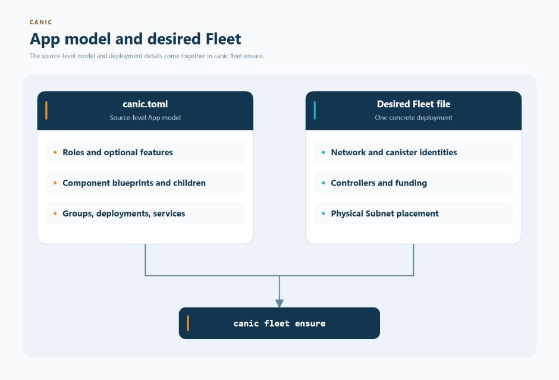
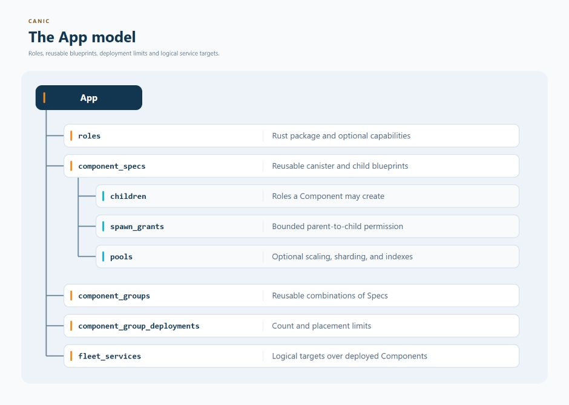

# Canic Configuration

`canic.toml` describes an application before it is deployed. It tells Canic
which kinds of canisters make up the App, how they relate to one another, which
optional features they use, and how far they are allowed to grow.

The file defines reusable role funding policies, including initial cycles and
top-ups. Concrete canister IDs, controllers, physical IC subnets and reviewed
deployment funding belong to a separate desired Fleet file so the same App
source can be installed in more than one environment.


This page is the complete field reference. New readers can begin with the
[configuration map](#configuration-map), then follow only the sections needed
for their App.

Before adding a setting, decide which configuration layer owns it:

<br clear="left" />

<p align="center">
  <a href="assets/app-model-desired-fleet.jpg">
    
  </a>
</p>

`canic.toml` is reusable source input. The desired Fleet is separately reviewed
operator intent; it may differ between local, staging, and production networks.

## App Shape At A Glance

<p align="center">
  <a href="assets/app-model.jpg">
    
  </a>
</p>

At a high level, the file describes:

- the App's name and each canister role implemented by a Rust package;
- global choices for authentication, logs, standards, and public monitoring;
- Component Specs, which are reusable blueprints for deployable canisters;
- which child canisters a Component may create and the limits on that growth;
- optional pools for dividing data or adding equivalent workers;
- Groups that combine Components and select how many copies to deploy; and
- Fleet services, which give application code a stable way to find selected
  deployed Components.

Canic validates every field during the Rust build, before a canister is
deployed. Every application canister crate also declares the App and role it
implements in `Cargo.toml`:

```toml
[package.metadata.canic]
app = "demo"
role = "app"
```

That package App must match `[app].name`, and the package role must
exist in `canic.toml`. `role = "root"` selects the root lifecycle and root
endpoint bundle; every other role selects the ordinary non-root lifecycle and
endpoint bundle.

---

## Configuration Map


| Concern | Owner in `canic.toml` |
| --- | --- |
| App identity and startup mode | [`[app]`](#app) |
| Package roles and optional observation providers | [`[roles.<role>]`](#rolesrole) |
| Global auth, logs, standards and public metrics | [Global keys](#global-keys) and [public metric publication](#public-metric-publication) |
| One Component blueprint and its descendant capability graph | [Component Specs](#component-specs) |
| Reusable multi-Component composition | [Component Groups](#component-groups) |
| Independent count, spread and reduction-only limits | [Component Group deployments](#component-group-deployments) |
| Logical Fleet-wide target selection | [Fleet services](#fleet-services) |

<br clear="left" />

Physical Subnets, concrete canister identities, controllers, deployment funding, and
decisions to replace or delete canisters belong to the separately reviewed
desired Fleet, not to App source configuration.

---

## Runtime Config + Env Lifecycle

Canic treats config/env identity as startup invariants. Missing env data is a fatal error.

- Build time: the build script selects `CANIC_CONFIG_PATH`, parses and validates
  its TOML on the host, then generates typed Rust configuration. It also retains
  compact TOML text for Root reporting; no TOML parser enters deployed Wasm.
  `ICP_ENVIRONMENT` is baked in (`local` or `ic`), defaulting to `local` when
  unset.
- Init/post-upgrade: generated lifecycle code installs the compiled typed model
  synchronously; `ConfigOps::current_*` is infallible.
- Root env: fresh root installation sets base fields from
  `CurrentRootInstallIdentity` without a registry lookup.
  - The Fleet Subnet Root sits outside every Component Spec.
  - One root may manage several admitted Component Specs.
  - The protected `fleet_subnet_root_pid` env field identifies the exact
    owning Fleet Subnet Root, not a Fleet-wide singleton root.
- Managed application env: Root supplies `CanisterInitPayload` with exact
  `CanisterInitAuthority::Component` or `ComponentChild` authority, release and
  install identities, protected deployment policy and selected admission data.
  - The authority carries the owning Root and the concrete `ComponentBinding`
    or `ComponentChildBinding`; Canic derives the runtime env from that binding.
  - Missing or inconsistent authority refuses initialization. The explicit
    standalone-local development path does not provide managed Fleet authority.

---

## Global Keys

### `[roles.<role>]`

Required package declaration for every Component or potential descendant attached
through `component_specs`. The `root` declaration is also required whenever
Component topology is present.

- `kind = "root" | "canister"` – package role class. Only `[roles.root]` may
  use `root`.
- `package: string` – required non-empty path for application roles, relative
  to this `canic.toml`. Root must omit this field: the host generates its build package with the
  selected configuration and capabilities.
- `fleet_admission: bool` – optional, default `false`. `true` enrolls every
  managed instance of this non-Root role in the Fleet admission participant
  set and gives it the local projection plus protected admission surfaces.
  Root declarations reject this field when true. Omission is fail-closed:
  that role receives no admission projection or admission surface. Enrollment
  does not itself protect application endpoints; each endpoint still selects
  its intended access policy explicitly.
- `[roles.<role>.observability]` – optional build-time selection of the
  `diagnostics`, `history`, `logs`, and `metrics` providers. Every switch
  defaults to `true`; setting one to `false` removes that optional generated
  read surface for the role. Health, readiness, binding, discovery, current
  cycle balance, and child-funding accounting remain available. See
  [public status and protected observability](docs/features/runtime/public-observability.md).

Role declarations own package identity. The matching
`component_specs.<name>` or
`component_specs.<name>.children.<role>` entry owns permitted topology and
Component-local policy.

### `[app]`

Required source identity and initial application mode.

- `name: string` – required immutable App identity used in role and build
  evidence.
- `init_mode = "enabled" | "readonly" | "disabled"` – default `enabled`.

Fleet user-ingress admission is not App source configuration. Declare its
generation-one Principal set and optional narrowing rules in the protected
Fleet installation input under `[admission]`; one App checkout may therefore
install different policies into different Fleets without rebuilding Wasm.

### `[log]`

Configure log retention for every canister.

- `max_entries: u64` – ring buffer cap on stored log entries (default `10000`).
- `max_entries` must be `<= 100000` (larger values are rejected at config validation).
- `max_entry_bytes: u32` – maximum message size in bytes per entry; oversized entries are truncated with a `...[truncated]` suffix (default `16384`).
- `max_age_secs: u64` – optional maximum age; entries older than this (in seconds) are purged (default `null` = no age limit).

### `[auth.delegated_tokens]`

Root/issuer delegated token authentication
(cert -> chain-key root proof -> issuer proof -> token).

- `enabled: bool` – enable delegated token auth (default `false`).
- `root_canister_id: string` – optional root canister trust anchor. If omitted, runtime verification uses the initialized Canic root env.
- `ic_root_public_key_raw_hex: string` – optional raw 96-byte IC BLS root public key encoded as hex. If omitted, runtime verification uses the IC/test root-key provider for issuer canister-signature proof verification.
- `build_network: "ic" | "local"` – network class bound into delegated-auth proofs and verifier policy (default `"ic"`).
- `max_ttl_secs: u64` – optional upper bound on delegated cert/token/session TTL in seconds (default `null` = runtime default cap; must be > 0 when set).

When delegated-token verification is enabled on a non-root endpoint canister,
startup requires issuer canister-signature verification support, an effective
root canister id, the raw IC root public key for the configured network, and a
complete chain-key root proof policy. Verification uses that policy directly.

#### `[auth.delegated_tokens.chain_key_root_proof]`

Trust anchor for `RootProof::IcChainKeyBatchSignatureV1`.

The resolved proof policy requires the fields below when delegated tokens are
enabled. `public_key_derivation` is an optional host-side input; when selected,
the build path fills the derived key and path hash before final validation.

- `public_key_derivation = "ic" | "pocketic"` – optional host-only catalog
  selection that derives `public_key_hex` and `derivation_path_hash_hex` before
  artifact generation. It must match `build_network`. Omit it when supplying
  explicit key material for another environment.
- `key_id: string` – IC chain-key ECDSA key id, such as `"key_1"`.
- `derivation_path_hash_hex: string` – canonical 32-byte hash of the derivation path, encoded as hex.
- `derivation_path_hex: [string, ...]` – derivation path components encoded as hex strings.
- `public_key_hex: string` – SEC1 secp256k1 public key for the configured root canister, key id, and derivation path.
- `key_version: u64` – configured signing key version expected in root proof headers.
- `min_accepted_key_version: u64` – verifier floor for accepted key versions.
- `min_accepted_proof_epoch: u64` – verifier floor for root proof epochs. For the byte-free V1 hard cut, deployments must set this strictly above their highest previously accepted proof epoch before issuing new material.
- `min_accepted_registry_epoch: u64` – verifier floor for delegated-auth registry epochs. For the byte-free V1 hard cut, deployments must set this strictly above their highest previously accepted registry epoch before issuing new material.
- `valid_from_ns: u64` – first accepted proof-policy time in nanoseconds.
- `accept_until_ns: u64` – last accepted proof-policy time in nanoseconds; must be greater than `valid_from_ns`.
- `max_revocation_latency_ns: u64` – maximum accepted policy revocation lag; must be greater than zero.
- `allow_test_key: bool` – allow `test_key_1` for `build_network = "local"` (default `false`). The `ic` build network always rejects `test_key_1`.

### `[auth.role_attestation]`

Root canister-signature role-attestation settings.

- `max_ttl_secs: u64` – maximum role-attestation lifetime in seconds (default `900`, must be > 0).
- `min_accepted_epoch_by_role.<role>: u64` – optional per-role epoch floor for rejecting older attestations. Application verification arguments may raise this floor but cannot lower it.

### `[standards]`

Feature toggles tied to public standards.

- `icrc21: bool` – enable the ICRC-21 consent endpoint (default `false`).

---

## Component Specs

Declare each permitted flat topology under `[component_specs.<name>]`.
The name is a bounded `ComponentSpecId` and has no physical placement or
runtime-parent meaning.

Each Component Spec declares exactly one Component directly below a Fleet
Subnet Root:

```toml
[component_specs.users]
component_role = "user_hub"
maximum_instances = 10
```

- `component_role` – required role of the Component Canister.
- `maximum_instances` – required positive Fleet-wide ceiling for concrete
  instances of this Spec.
- Component policy fields (`initial_cycles`, `topup`, `cycles_funding`,
  `scaling`, `sharding`, `index`, `auth`, `standards`, `diagnostics`, and
  `metrics`) configure that Component.
- `limits` compiles finite aggregate descendant, Registry, and cycles-funding
  quotas into every concrete Component binding.
- `children.<role>` – optional flat potential-descendant role tables. The
  name is retained because every runtime instance is created as a direct child
  of some registered node; table nesting does not encode runtime parentage.
- `spawn_grants.<parent-role>.<child-role>` – explicit bounded permission for
  a registered role to request one direct child role.

The sum of all Component Spec `maximum_instances` values must not exceed
4,096. A Component role occurs in exactly one Spec and may also be a potential
descendant in another Spec. A descendant role may be reused by several Specs because the one global
`[roles.<role>]` declaration fixes its package/artifact identity; ownership
still resolves through the exact Spec, concrete Component instance, and
runtime immediate-parent binding.

Component Specs cannot include one another and child tables cannot nest.
That flat declaration shape is not a runtime depth limit: any exact registered
node in the Component tree may ask its Fleet Subnet Root to create a direct
child only when the role appears in the Spec's catalog and an exact spawn
grant connects the requester's registered role to that child role. `root`,
`service`, and `component` are structural roles, not accepted child `kind`
values.

### Implicit `wasm_store`

Every Fleet Subnet Root has one mandatory root-local `wasm_store`. It is
bootstrapped implicitly, sits outside Component topology, and must not be
declared in `canic.toml`.

Current implicit Store preset:

- canister role: `wasm_store`
- kind: implicit `singleton`
- `max_store_bytes = 40000000`
- `headroom_bytes = 4000000`
- `max_templates = none`
- `max_template_versions_per_template = none`

Rules:

- do not define a `wasm_store` role as a Component or child
- ordinary Component and descendant roles install from published chunked
  manifests in this Store
- inline install is reserved for bootstrapping `wasm_store` itself

### `[component_specs.<name>.children.<role>]`

Each child table configures one potential descendant role in the Component
tree. The Fleet Subnet Root installs that role only as a direct child of the
exact registered requester and stores the immediate parent in the protected
binding. The role is derived from the table key; do not declare `role`, `type`,
`owner_component`, another Component, or another `children` table.

- `kind = "singleton" | "replica" | "shard" | "instance"` – required
  lifecycle class for that role.
- `initial_cycles = "5T"` – cycles to allocate when provisioning (defaults to 5T).
- `topup.threshold = "10T"` – minimum cycles before requesting a top-up
  (default `10T` when the `topup` table is present).
- `topup.amount = "5T"` – cycles to request when topping up (default `5T`
  when the `topup` table is present; it cannot exceed half the threshold).
  Omit `topup` entirely to disable auto top-ups.

Cycle amount fields use exact decimal `K`, `M`, `B`, `T`, or `Q` shorthand.
They must resolve to a whole number of cycles within `u128`; Canic does not
round, truncate, or saturate them.
- `scaling` – optional table that defines stateless replica pools.
- `sharding` – optional table that defines stateful shard pools.
- `index` – optional table that defines keyed instance pools.
- `auth.delegated_token_issuer = true` – mark this role as a delegated-token issuer; Canic requires local issuer canister-signature support for token issuance.
- `auth.delegated_token_verifier = true` – mark this role as a delegated-token
  verifier; the role contract requires the matching verifier feature and the
  global delegated-token trust policy.
- `auth.role_attestation_cache = true` – start the role-attestation key cache for canisters that verify root-signed role attestations. Delegated-token endpoint verification itself is driven by endpoint guards and `auth.delegated_tokens`, not this flag.
- `auth.local_application_authorization` – optional role-local application
  session policy with required `allowed_scopes`, `default_session_ttl_secs`,
  and `maximum_session_ttl_secs`. Scope ordering is normalized; TTLs and scope
  bounds are validated before build.
- `standards.icrc21 = true` – enable the canister-local ICRC-21 endpoint. This
  is separate from the global `[standards]` setting.
- `diagnostics.memory_ledger = true` – opt this role into the controller-only `canic_memory_ledger` recovery diagnostic. The endpoint is omitted by default to keep the shared Candid/runtime surface smaller.
- `metrics.profile = "leaf" | "hub" | "storage" | "root" | "full"` – override
  the role-derived metrics profile.

The same cycles, placement, auth, standards, diagnostics, and metrics fields
also apply directly to the Component Spec table. Placement pools refer to
roles in that Spec's flat potential-descendant catalog and require a matching
spawn grant from the role that owns the pool. The concrete runtime parent is
always the exact registered requester, not the declaration table or pool.

#### Spawn Grants

Spawn grants form a flat role-to-role capability graph. They do not nest child
configuration and do not pre-create a hierarchy:

```toml
[component_specs.<name>.spawn_grants.project_hub.project_instance]
maximum_instances_per_parent = 10000

[component_specs.<name>.spawn_grants.project_instance.project_ledger]
maximum_instances_per_parent = 1
```

- the parent is the Component role or one role in the same child catalog;
- the target is one role in that child catalog;
- `maximum_instances_per_parent` is required and positive;
- a `singleton` target requires exactly `1`;
- every child catalog role needs at least one incoming grant; and
- catalog membership selects the accepted artifact, while the grant supplies
  creation authority.

Role-graph recursion is allowed, but every concrete Registry parentage graph
is a finite tree bounded by the Component and root quotas.

#### Peer Component Provisioning

A Component Spec may request another exact Spec only through an explicit
root-local provisioning grant:

```toml
[component_specs.api.provisions.worker]
maximum_instances_per_requester_per_root = 4
```

The table key names the peer Component Spec. The positive limit bounds how many
instances one concrete requester may cause on one Fleet Subnet Root. This is
separate from `spawn_grants`: provisioning creates a peer top-level Component,
while a spawn grant creates a descendant inside the requester's own Component
tree. Physical placement and Fleet-wide admission remain Coordinator/Root
authority.

#### Component aggregate limits

Every Component has finite aggregate limits in addition to each child's own
policy:

```toml
[component_specs.<name>.limits]
maximum_descendants = 20000
maximum_registry_bytes = 16777216

[component_specs.<name>.limits.cycles_funding]
window_secs = 3600
maximum_cycles = "1000T"
```

- `maximum_descendants` bounds the total descendant instances in one concrete
  Component tree at every depth (default `20000`). It is the aggregate backstop
  above the independent spawn-grant ceilings and must be positive when the
  Spec declares children.
- `maximum_registry_bytes` bounds that Component's canonical Registry
  records, indexes, retained operations and tombstones (default `16777216`,
  and must be positive).
- `cycles_funding.window_secs` and `maximum_cycles` form a positive aggregate
  budget above per-child request, cumulative, and cooldown limits (defaults
  `3600` and `"1000T"`).

One Component Spec may declare at most 256 distinct potential-descendant roles
and 4,096 spawn grants. The complete canonical Fleet Component Topology is
bounded to 2 MiB.

#### Parent cycles funding

`cycles_funding` limits cycle requests made by this role to its parent. It is
always active as policy; omitted values use finite defaults.

- `max_per_request = "5T"` – maximum granted by one request.
- `max_per_child = "100T"` – cumulative parent budget for one child.
- `cooldown_secs = 60` – minimum time between grants for the child.

`max_per_request` must not exceed `max_per_child`, and all three values must be
positive.

The `wasm_store` role is reserved and implicit.
Do not add it under `component_specs.*`.

#### Scaling Pools

Scaling pools model interchangeable replicas with simple bounds on how many to keep alive.

```toml
[component_specs.<name>.scaling.pools.<pool>]
canister_role = "replica_role"
policy.initial_workers = 1
policy.min_workers = 2
policy.max_workers = 16
```

Fields:

- `canister_role` – potential-descendant role in the same Component Spec with
  `kind = "replica"`.
- `policy.initial_workers` – workers to create during canister startup warmup (default `1`).
- `policy.min_workers` – minimum workers to keep alive (default `1`).
- `policy.max_workers` – positive hard cap on workers (default `32`), no
  greater than the matching spawn grant's
  `maximum_instances_per_parent`.

#### Placement Index Pools

Placement Index pools place keyed stateful instances.

```toml
[component_specs.<name>.index.pools.<pool>]
canister_role = "instance_role"
key_name = "project"
```

- `canister_role` – potential-descendant role in the same Component Spec with
  `kind = "instance"`.
- `key_name` – non-empty logical key name used by keyed placement admission.

A Placement Index is application-owned keyed state. It is not a Canic
Directory: Directories are read-only discovery projections derived from
authoritative Registry state. Index entries do not prove membership or grant
lifecycle authority.

#### Sharding Pools

Sharding pools manage stateful shards that own capacity-bounded partitions.

```toml
[component_specs.<name>.sharding.pools.<pool>]
canister_role = "shard_role"
policy.capacity = 1000
policy.max_shards = 64
```

Fields:

- `canister_role` – potential-descendant role in the same Component Spec with
  `kind = "shard"`.
- `policy.capacity` – per-shard capacity (default `1000`, must be > 0).
- `policy.initial_shards` – shards created by initial warmup (default `1`; may
  be `0`, but cannot exceed `max_shards`).
- `policy.max_shards` – maximum shard count (default `4`, must be positive and
  no greater than the matching spawn grant's
  `maximum_instances_per_parent`).

---

## Component Groups

Component Groups are reusable configuration-only compositions. They do not
create a Group canister, runtime parent, controller, or local Wasm Store.

Direct members select Component Specs:

```toml
[component_groups.api_cell.components.api]
component_spec = "api"
labels.region = "eu"
```

Nested members include another Group:

```toml
[component_groups.full_stack.groups.data]
component_group = "data_cell"
```

The final path segment is the member ID. A direct component requires
`component_spec`; an included group requires `component_group`. Both member
kinds accept bounded `labels`. Groups may include other Groups, but the graph
must be acyclic and compiles to a finite flattened list.

A direct component may set `service = "<service-id>"`. A service member may
also receive `service_purpose = "authority" | "replica" | "pool_member"`;
ordinary members cannot receive a service purpose. Purpose may instead be
assigned by an enclosing included-group edge or deployment, but each effective
service member must resolve to one compatible purpose.

## Component Group Deployments

Each deployment independently scales one reusable Group:

```toml
[component_group_deployments.api_cells]
component_group = "api_cell"
service_purpose = "pool_member"
initial_placements = 2
maximum_placements = 8
placement.maximum_per_root = 2
placement.minimum_distinct_roots = 2
labels.tier = "public"
```

- `component_group` selects the reusable composition.
- `initial_placements` is the initial count and may be zero.
- `maximum_placements` is a positive scale-out ceiling and must be at least the
  initial count.
- `placement.maximum_per_root` is the positive density ceiling.
- `placement.minimum_distinct_roots` is the positive spread requirement and
  cannot exceed what the placement ceiling can satisfy.
- `service_purpose` optionally supplies one purpose to the deployment's
  service members; it does not turn ordinary members into services.
- `labels` supplies bounded deployment-wide labels.

Reduction-only per-member limits use a TOML array of tables. `member` is the
flattened member path, including every nested Group member ID:

```toml
[[component_group_deployments.api_cells.member_limits]]
member = ["api"]
maximum_descendants = 1000
maximum_registry_bytes = 8388608

[[component_group_deployments.api_cells.member_limits.spawn_grants]]
parent_role = "api"
child_role = "worker"
maximum_instances_per_parent = 8
```

These values may only reduce the owning Component Spec's limits; deployments
cannot expand source authority.

## Fleet Services

`[services.fleet.targets.<service-id>]` declares a logical Fleet-wide service
over exact grouped occurrences. It never names physical Roots or concrete
canister Principals.

An active pool selects every current compatible `pool_member` occurrence:

```toml
[services.fleet.targets.api]
mode = "active_pool"
role = "api"
component_spec = "api"
placement.maximum_members_per_root = 2
placement.minimum_distinct_roots = 2
```

An authority/replica service additionally binds its unique authority member:

```toml
[services.fleet.targets.database]
mode = "authority_replica"
role = "database"
component_spec = "database"
authority_deployment = "database_authority"
authority_member = ["database"]
placement.maximum_members_per_root = 1
placement.minimum_distinct_roots = 1
```

The named role must be the selected Component Spec's top-level role. Every
service occurrence comes from a Group member carrying the same service ID and
a mode-compatible purpose. Placement fields are positive logical-service
density/spread bounds; physical assignments remain protected deployment output.

---

## Example

```toml
# CANIC_CONFIG_EXAMPLE_START
[app]
name = "example"

[roles.root]
kind = "root"

[roles.app]
kind = "canister"
package = "app"
fleet_admission = true

[roles.user_hub]
kind = "canister"
package = "user_hub"

[roles.user_shard]
kind = "canister"
package = "user_shard"

[roles.scale_hub]
kind = "canister"
package = "scale_hub"

[roles.scale]
kind = "canister"
package = "scale"

[auth.delegated_tokens]
enabled = false
# root_canister_id = "..."
# ic_root_public_key_raw_hex = "..."
build_network = "local"
#
# [auth.delegated_tokens.chain_key_root_proof]
# key_id = "key_1"
# derivation_path_hash_hex = "..."
# derivation_path_hex = ["63616e6963", "64656c65676174696f6e"]
# public_key_hex = "..."
# key_version = 1
# min_accepted_key_version = 1
# min_accepted_proof_epoch = 2
# min_accepted_registry_epoch = 2
# valid_from_ns = 1
# accept_until_ns = 4102444800000000000
# max_revocation_latency_ns = 60000000000
# allow_test_key = true

[standards]
icrc21 = true

[component_specs.app]
component_role = "app"
maximum_instances = 1

[component_specs.users]
component_role = "user_hub"
maximum_instances = 1
topup.threshold = "10T"
topup.amount = "5T"

[component_specs.users.limits]
maximum_descendants = 20000
maximum_registry_bytes = 16777216

[component_specs.users.sharding.pools.user_shards]
canister_role = "user_shard"
policy.capacity = 100
policy.initial_shards = 1
policy.max_shards = 4

[component_specs.users.children.user_shard]
kind = "shard"

[component_specs.users.spawn_grants.user_hub.user_shard]
maximum_instances_per_parent = 4

[component_specs.scaling]
component_role = "scale_hub"
maximum_instances = 1
topup.threshold = "10T"
topup.amount = "5T"

[component_specs.scaling.scaling.pools.scales]
canister_role = "scale"
policy.initial_workers = 1
policy.min_workers = 2
policy.max_workers = 32

[component_specs.scaling.children.scale]
kind = "replica"

[component_specs.scaling.spawn_grants.scale_hub.scale]
maximum_instances_per_parent = 32

[component_groups.user_cell.components.users]
component_spec = "users"
service = "users"

[component_group_deployments.user_cells]
component_group = "user_cell"
service_purpose = "pool_member"
initial_placements = 1
maximum_placements = 1
placement.maximum_per_root = 1
placement.minimum_distinct_roots = 1

[services.fleet.targets.users]
mode = "active_pool"
role = "user_hub"
component_spec = "users"
placement.maximum_members_per_root = 1
placement.minimum_distinct_roots = 1
# CANIC_CONFIG_EXAMPLE_END
```

This example defines three flat Component Specs, enables ICRC-21, grants
`user_hub` permission to create shards, grants `scale_hub` permission to create
replicas, and deploys one `users` active-pool service member through a reusable
Group. Each occupied Fleet/Subnet root gets one implicit
`wasm_store`; physical Subnet placement and root-local Component admissions
are separate deployment input.

---

## Runtime Release Metadata vs Static Config

`canic.toml` no longer defines wasm-store topology or capacity policy.
It does not enumerate every published template release.

Static config owns:

- user-defined canister roles and policies
- flat Component Specs, potential-descendant catalogs and bounded spawn grants
- Component roles that a Fleet Subnet Root may create from admitted Specs
- reusable Component Groups, deployment envelopes and logical Fleet services

Root-authoritative runtime state owns:

- approved manifest records
- logical template release metadata (`template_id`, `version`, `role`, `payload_hash`, `payload_size_bytes`, `chunking_mode`)
- publication binding / store placement state used for install resolution

Template stores own:

- chunk sets
- deterministic chunk metadata
- template-version storage data

This separation is deliberate:

- config defines the user-managed flat Component topology only
- root-approved manifest/runtime state defines what is installable and which implicit store is active
- wasm stores hold the bytes and deterministic chunk-set metadata only

## Public metric publication

The top-level `public_metrics` selection is empty by default. Supported values
are `application`, `cycles`, `operations`, `performance` and `shard_occupancy`.
Enabling a family publishes only its bounded cached aggregate snapshot through
`canic_public_status`; it never changes `canic_observability` authorization.
See [public observability](docs/features/runtime/public-observability.md) for
sampling, staleness, units and application publication APIs.

## Continue From Here

- [Build your first managed application](docs/getting-started/minimal-managed-fleet.md)
- [Choose the Canic features you need](docs/features/README.md)
- [Plan and operate a Fleet](docs/operations/README.md)
- [Browse all documentation](docs/README.md)
