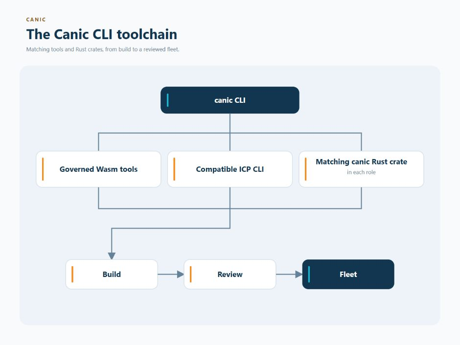

# Installing Canic

Canic has two pieces that work together:

- the `canic` command-line program, which runs on your computer; and
- the `canic` Rust crate, which is compiled into your application canisters.

## Choose An Installation Path

<table>
  <thead>
    <tr>
      <th aria-label="Guide"></th>
      <th>Goal</th>
      <th>Install</th>
    </tr>
  </thead>
  <tbody>
    <tr>
      <td rowspan="3" width="120" valign="top">
        
      </td>
      <td>Use a published Canic release</td>
      <td>Published CLI, governed Wasm tools, compatible <code>icp</code>, and the matching Rust crate</td>
    </tr>
    <tr>
      <td>Work on this repository</td>
      <td>Local CLI from the checkout</td>
    </tr>
    <tr>
      <td>Maintain or release Canic</td>
      <td>Complete repository toolchain</td>
    </tr>
  </tbody>
</table>

<p align="center">
  <a href="assets/cli-toolchain.jpg">
    
  </a>
</p>

## Install The CLI

Use the same Canic version for both pieces. To install the published
command-line program:

```bash
cargo install --locked canic-cli --version <same-version-as-canic>
canic --version
```

If you are developing Canic itself from this repository, install the local
version instead:

```bash
make install
```

Canic maintainers can install the complete repository toolchain:

```bash
make install-dev
```

## Install The Wasm Tools

The maintainer setup installs the repository-selected ICP command-line tool,
`ic-wasm`, Binaryen, Candid tools and `sccache`, and configures the repository
pre-commit formatter. Every artifact build requires `ic-wasm 0.11.1`; release
builds also require the checksum-bound Binaryen 132 `wasm-opt`. Builds fail
during tool preflight rather than accepting another version or emitting
noncanonical bytes. Published CLI users can install both governed Wasm tools
without a Canic checkout:

```bash
canic toolchain install
```

The command prints both admitted executable paths under `~/.local/bin`. Canic
prefers those canonical paths and passes them directly to every transform, so
shell `PATH` changes are not required for `canic build`; PATH is used only when
the canonical installation is absent. Installation warns when `HOME=/`, while
missing-tool diagnostics name the canonical path that was checked. Explicit
`CARGO_TARGET_DIR` and Cargo compiler-wrapper settings remain authoritative.
Canic artifact builds force `CARGO_INCREMENTAL=0` and use Cargo's selected
wrapper; configure `RUSTC_WRAPPER` or Cargo settings to use a compiler cache.
The repository's Make flow separately discovers `sccache` when no wrapper is set.

## ICP CLI compatibility

The `icp` command-line program performs low-level IC operations for Canic, such
as running a local network, installing canisters, and managing snapshots.

The maintained range is `icp-cli >=1.5.0, <2.0.0`; the maintainer toolchain currently pins `1.6.0`.

```bash
which icp
icp --version
bash scripts/ci/install-icp-cli.sh
```

The installer writes the verified binary to `~/.cargo/bin/icp` by default.
If another `icp` appears earlier on `PATH`, the shell may still run the older
binary. Check with `type -a icp`, then select the installed binary in the
current shell:

```bash
export PATH="$HOME/.cargo/bin:$PATH"
hash -r
icp -V
```

For future shells, put `~/.cargo/bin` before the other `icp` location in your
shell startup configuration.

Custom connected networks must declare their exact root key. Enroll that trust
through Canic before Fleet observation or mutation. Obtain the expected SHA-256
fingerprint from the network operator through an authenticated publication or
an independent trusted channel. Copy that value into `network_root_fingerprint`
below and compare the local digest with it. A fingerprint computed from the
same untrusted key download provides no authenticity check. Canic rejects a
mismatch before writing network authority.

```bash
network_root_fingerprint='<64-lowercase-hex-from-the-network-operator>'
sha256sum ./root-key.der
canic network enroll <environment> \
  --root-key ./root-key.der \
  --fingerprint "$network_root_fingerprint"
```

For password-protected identities, ICP CLI can cache a bounded session:

```bash
icp settings session-length 1h
icp identity reauth <identity-name> --duration 1h
```

## Canister Dependencies


A Rust crate that builds one Canic-managed canister needs runtime dependencies,
a build dependency, and a small metadata block that tells Canic which App and
role it implements:

```toml
[dependencies]
candid = "<version>"
canic = "<same-version-as-cli>"
ic-cdk = "<version>"

[build-dependencies]
canic = "<same-version-as-cli>"

[package.metadata.canic]
app = "example"
role = "app"
```

The **role** is the canister's job in the application. It must exist in the
selected App configuration. Application developers provide their application
canister packages. Canic generates its own Root, Coordinator, and Store
management packages from the configuration.

<br clear="left" />

The build script remains small:

```rust
fn main() {
    canic::build!("../canic.toml");
}
```

An ordinary managed canister uses the maintained lifecycle facade:

```rust
#![expect(clippy::unused_async)]

use canic::prelude::*;

canic::start!();

async fn canic_setup() {}
async fn canic_install(_: Option<Vec<u8>>) {}
async fn canic_upgrade() {}

canic::finish!();
```

Application endpoints belong between `start!` and `finish!` and use Canic's
endpoint macros. The complete App schema is in [CONFIG.md](CONFIG.md).

## Configure And Build

These commands create an App, create a Rust canister package for its `app` role,
connect that role to a Component blueprint, and build it:

```bash
canic app create example
canic scaffold canister example app
canic app role attach example app --component-spec example.app
canic build example app --profile release \
  --provenance artifacts/example-app-provenance.json
```

For split Cargo/ICP roots, pass `--workspace`, `--icp-root` and an absolute
`--config` path explicitly.

## Ensure A Fleet

One deployed copy of an App is called a **Fleet**. Canic uses a separate desired
Fleet file to describe the concrete network, canisters, funding, and placement
that an operator intends to create.

Start the selected local replica when applicable:

```bash
canic replica start --background
```

Write the current desired Fleet contract at `fleets/<fleet>.toml`; its complete
schema and cycle-safety boundary are in
[Fleet ensure](docs/features/operations/fleet-ensure.md).

Plan first:

```bash
canic fleet ensure example-local --desired fleets/example-local.toml
```

Review the returned `plan_sha256`, dispositions, transfers, fees, funding,
maximum debit/burn and conservation equation. Apply only that digest:

```bash
canic fleet ensure example-local \
  --desired fleets/example-local.toml \
  --apply <plan_sha256>
```

Rerun the same apply command after interruption. The current journal reconciles
the live result before retry. After terminal convergence, run plan/apply again
to prove the immediate successor has zero mutation actions.

For explicitly supplied infrastructure IDs, follow
[supplied infrastructure bootstrap](docs/features/operations/fleet-ensure.md#supplied-infrastructure-bootstrap).
For additional pool canisters on a ready Root's subnet, follow
[capacity import](docs/features/operations/fleet-ensure.md#add-supplied-capacity-to-a-current-fleet).
Both require their own reviewed authority before ordinary Fleet convergence.

Release transitions are reinstall-only. Explicit reset review uses the selected
current build, complete physical inventory and current controllers; it does not
require a completed predecessor or a readable predecessor application schema.
Preserve retained evidence and reconcile genuinely uncertain paid or controller
effects before reset. Follow the
[retained-plan guidance](docs/features/operations/fleet-ensure.md#unreadable-retained-plan).
Every controlled canister with recoverable cycles must be accounted for before
destructive effects.

## Cycle-Recovery Limitation


The IC does not let a controller pull cycles from an arbitrary canister. A
canister with a material cycle balance may be physically replaced or deleted
only when it exposes the exact configured, idempotent treasury-drain contract.
Without it, Canic returns a typed blocker and leaves the canister untouched.
Never bypass that blocker with
a raw stop/delete command. ID-preserving clean reinstall retains native cycles
on the selected canisters; it clears their application and framework state
under a separate reviewed reset operation.

<br clear="left" />

## Development Validation

Automated coding work runs only targeted package checks. Human maintainers own
the complete release boundary:

```bash
make validate
```

Versioning, tagging, package publication, pushing and live deployment remain
separate human-owned actions governed by
[CI and deployment governance](docs/governance/ci-deployment.md).

## Continue From Here

- [Build your first managed application](docs/getting-started/minimal-managed-fleet.md)
- [Configure an App](CONFIG.md)
- [See how Canic works](docs/getting-started/how-canic-works.md)
- [Choose the Canic features you need](docs/features/README.md)
- [Plan and operate a Fleet](docs/operations/README.md)
- [Browse all documentation](docs/README.md)
