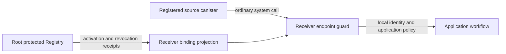

# Canic Authentication Design

- **Status:** canonical current design
- **Contract:** current hard-cut delegated-token contract
- **Audience:** Canic maintainers and downstream application developers
- **Primary rule:** auth is enforced at endpoints; workflow, ops, policy, DTO, and model code receive already-authenticated input.

This document is the current authentication design for Canic. Historical
release-slice notes live under `docs/design/`; exact runtime/wire contracts live
under `docs/contracts/`.

## 1. Auth Surfaces

Canic has three auth surfaces:

1. Transport/topology predicates:
   - controllers
   - Fleet-admitted principals
   - parent/root/child/same-canister checks
   - registry role checks
2. Delegated-token endpoint auth:
   - caller supplies a `DelegatedToken`
   - endpoint guard validates token and binds
     `claims.presenter == claims.subject == msg_caller`
   - endpoint-required scope must appear in the token grant for the local role
3. Role-attestation endpoint auth:
   - caller supplies a `SignedRoleAttestation`
   - endpoint guard validates the embedded role-attestation root proof
   - service-role checks stay local and make no root or management-canister call

Auth code lives at the boundary:

```text
endpoint macro / access guard
  -> access::auth / api::auth
  -> ops::auth
  -> storage key/session cache only where needed
```

Model, DTO, policy, and ordinary workflow code must not introduce hidden auth
checks.

## 2. Delegated Token Trust Model

Delegated auth is self-validating.

```text
configured root principal
  + configured chain-key root verifier policy
  -> RootProof::IcChainKeyBatchSignatureV1
  -> root-signed batch header
  -> issuer Merkle witness
  -> root-authorized DelegationCert
  -> issuer canister-signature proof over claims_hash
  -> authenticated delegated subject
```

A verifier validates a delegated token using only:

- the token
- the embedded `DelegationProof`
- configured root identity
- configured chain-key root verifier policy
- configured network label paired with the effective raw IC root public key
- issuer proof embedded in the token
- protected Fleet identity and configured role
- IC canister time

A verifier must not require:

- local proof presence
- proof fanout from root
- creation-time proof catch-up
- proof history replication
- registry snapshots for delegated-token audience membership
- topology placement ordering
- query-time or first-use public-key fetching
- cascaded `SubnetState.auth.delegated_root_public_key`

In this document, "proof" means the embedded `DelegationProof` carried inside
`DelegatedToken`. It never means verifier-local proof state.

Delegated tokens are not one-shot receipts. A token that verifies may authorize
multiple update or query calls until `claims.expires_at_ns`.

## 3. Data Structures

Source of truth: `crates/canic-core/src/dto/auth/`.

```rust
pub enum DelegationAudience {
    Fleet(FleetKey),
}

pub struct DelegatedRoleGrant {
    pub target: CanisterRole,
    pub scopes: Vec<String>,
}

pub enum IssuerProofAlgorithm {
    IcCanisterSignatureV1,
}

pub enum IssuerProofBinding {
    IcCanisterSignatureV1 { seed_hash: [u8; 32] },
}

pub enum ChainKeyAlgorithm {
    EcdsaSecp256k1,
}

pub struct ChainKeyKeyId {
    pub name: String,
}

pub enum RootProof {
    IcChainKeyBatchSignatureV1(IcChainKeyBatchSignatureProofV1),
}

pub struct IcCanisterSignatureProofV1 {
    pub signature_cbor: Vec<u8>,
    pub public_key_der: Vec<u8>,
}

pub struct IcChainKeyBatchSignatureProofV1 {
    pub header: ChainKeyBatchHeaderV1,
    pub delegation_cert: ChainKeyDelegationCertV1,
    pub issuer_witness: ChainKeyBatchWitnessV1,
    pub signature: ChainKeyRootSignatureV1,
}

pub struct ChainKeyBatchHeaderV1 {
    pub schema_version: u16,
    pub root_canister_id: Principal,
    pub batch_id: [u8; 32],
    pub proof_epoch: u64,
    pub registry_epoch: u64,
    pub registry_hash: [u8; 32],
    pub tree_root: [u8; 32],
    pub not_before_ns: u64,
    pub expires_at_ns: u64,
    pub algorithm: ChainKeyAlgorithm,
    pub key_id: ChainKeyKeyId,
    pub derivation_path_hash: [u8; 32],
    pub key_version: u64,
}

pub struct ChainKeyDelegationCertV1 {
    pub root_canister_id: Principal,
    pub issuer_canister_id: Principal,
    pub proof_epoch: u64,
    pub issuer_proof_algorithm: IssuerProofAlgorithm,
    pub issuer_proof_binding_hash: [u8; 32],
    pub issuer_proof_binding: IssuerProofBinding,
    pub max_token_ttl_ns: u64,
    pub audience: DelegationAudience,
    pub grants: Vec<DelegatedRoleGrant>,
    pub not_before_ns: u64,
    pub expires_at_ns: u64,
    pub registry_epoch: u64,
    pub registry_hash: [u8; 32],
}

pub struct ChainKeyRootSignatureV1 {
    pub algorithm: ChainKeyAlgorithm,
    pub key_id: ChainKeyKeyId,
    pub derivation_path: Vec<Vec<u8>>,
    pub public_key: Vec<u8>,
    pub signature: Vec<u8>,
}

pub struct ChainKeyBatchWitnessV1 {
    pub steps: Vec<ChainKeyBatchWitnessStepV1>,
}

pub struct DelegationCert {
    pub root_pid: Principal,
    pub issuer_pid: Principal,
    pub issuer_proof_alg: IssuerProofAlgorithm,
    pub issuer_proof_binding_hash: [u8; 32],
    pub issuer_proof_binding: IssuerProofBinding,
    pub issued_at_ns: u64,
    pub not_before_ns: u64,
    pub expires_at_ns: u64,
    pub max_token_ttl_ns: u64,
    pub aud: DelegationAudience,
    pub grants: Vec<DelegatedRoleGrant>,
}

pub struct DelegationProof {
    pub cert: DelegationCert,
    pub root_proof: RootProof,
}

pub struct DelegatedTokenClaims {
    pub presenter: Principal,
    pub subject: Principal,
    pub issuer_pid: Principal,
    pub cert_hash: [u8; 32],
    pub issued_at_ns: u64,
    pub expires_at_ns: u64,
    pub aud: DelegationAudience,
    pub grants: Vec<DelegatedRoleGrant>,
    pub nonce: [u8; 16],
    pub ext: Option<Vec<u8>>,
}

pub struct DelegatedToken {
    pub claims: DelegatedTokenClaims,
    pub proof: DelegationProof,
    pub issuer_proof: IssuerProof,
}

pub enum IssuerProof {
    IcCanisterSignatureV1(IcCanisterSignatureProofV1),
}
```

All protocol timestamps are nanoseconds since Unix epoch. Human-facing config
may use seconds; protocol DTOs and canonical encodings use `_ns` fields.

### Field Authority

- `root_pid`: set by root and checked against verifier config.
- `issuer_pid`, `issuer_proof_alg`, `issuer_proof_binding_hash`,
  and `issuer_proof_binding`: set by root after binding the issuer
  canister-signature authority, then authorized by the root chain-key batch
  proof.
- `cert.aud`, `cert.grants`, cert time fields, and `max_token_ttl_ns`: set by
  root and authorized by the root proof.
- `ChainKeyBatchHeaderV1`: set by root and signed by IC chain-key threshold
  ECDSA through the management canister.
- `ChainKeyDelegationCertV1`: set by root as the issuer leaf and checked for
  coherence with `DelegationCert`.
- `claims.presenter`, `claims.subject`, `claims.aud`, `claims.grants`, token
  time fields, and `nonce`: set by the issuer and signed by the issuer. The
  presenter and subject are both derived from the authenticated preparation
  caller.
- `claims.ext`: opaque application data set by the issuer, signed as part of
  `DelegatedTokenClaims`, and interpreted only by application endpoints.
- `claims.cert_hash`: hash of canonical `DelegationCert`; set by issuer and
  verified by every verifier.
- `claims.issuer_pid`: must equal `cert.issuer_pid`.

`nonce` is deterministic issuer-generated uniqueness material. It is not
secret, not a replay key, and not an authorization input. The issuer derives it
from caller, prepare operation id, issuer, and selected cert hash without
`raw_rand` or any management-canister call.

## 4. Canonical Encoding

Signed payloads use Canic's auth canonical encoding in
`ops/auth/delegated/canonical.rs`, not Candid bytes and not serde bytes.

Canonical hashes:

```rust
cert_hash = sha256(canonical_bytes(DelegationCert))
claims_hash = sha256(canonical_bytes(DelegatedTokenClaims))
chain_key_batch_header_hash = sha256(canonical_bytes(ChainKeyBatchHeaderV1))
chain_key_delegation_cert_hash =
    sha256(canonical_bytes(ChainKeyDelegationCertV1))
role_hash = sha256(canonical_role_bytes(CanisterRole))
issuer_proof_binding_hash =
    sha256("canic-issuer-proof-binding-v1" ||
           issuer_pid ||
           issuer_proof_alg ||
           canonical_bytes(issuer_proof_binding))
```

Strict canonical rules:

- role grants must already be strictly sorted by role and duplicate-free
- scopes inside each grant must already be strictly sorted and duplicate-free
- role and scope strings must be non-empty ASCII strings using only `[a-z0-9_:-]`
- Fleet audience strings must be non-empty ASCII strings using only `[a-z0-9_:-.]`
- token `ext` payloads are optional opaque bytes and must not exceed 4096 bytes
- no verifier-role or verifier-principal audience exists
- verifier rejects noncanonical vectors rather than normalizing them

This is intentional: one semantic token must have one valid canonical encoding.

## 5. Root Proof Issuance

Entrypoint paths:

```text
root-managed renewal timer
  -> AuthOps::prepare_due_chain_key_root_delegation_batch
  -> AuthOps::sign_next_chain_key_root_delegation_batch
  -> management canister sign_with_ecdsa
  -> AuthOps::start_next_chain_key_root_delegation_batch_install
  -> root broadcasts canic_command::InstallDelegationProof to issuers

issuer lazy repair
  -> issuer canic_command::PrepareDelegatedToken sees missing/stale active proof
  -> root canic_root_command::GetOrCreateDelegationProof update
  -> root returns cached proof or singleflight creates one signed batch
  -> issuer verifies and stores active proof

root issuer readiness provisioning
  -> app root calls AuthApi::provision_chain_key_delegation_proof_for_issuer_root
  -> root reuses the same cached/singleflight chain-key batch path
  -> root calls canic_command::InstallDelegationProof on the issuer
  -> root records the issuer install outcome
```

Root issuance steps:

1. Require local canister is root.
2. Require root-controller authorization for issuer configuration.
3. Configure each issuer through `canic_root_command::ConfigureIssuer` before
   preparing root proof material. One explicit audience, grant set, certificate
   TTL and refresh ratio produce both policy and automatic renewal configuration.
   Identical configuration retries preserve the registry epoch and signed batches.
4. Validate each issuer against the root issuer registry.
5. Load `auth.delegated_tokens` config.
6. Bind each requested issuer canister to
   `IssuerProofAlgorithm::IcCanisterSignatureV1` with seed
   `b"canic-issuer-delegated-token"`.
7. Build each `DelegationCert` and `ChainKeyDelegationCertV1` issuer leaf.
8. Enforce:
   - `cert.root_pid == self`
   - `cert.not_before_ns < cert.expires_at_ns`
   - cert TTL does not exceed `auth.delegated_tokens.max_ttl_secs`
   - `cert.max_token_ttl_ns > 0`
   - `cert.max_token_ttl_ns <= cert_ttl_ns`
   - audience shape is canonical
   - role grants are non-empty, bounded, sorted, and canonical
   - `cert.issuer_pid` equals the requested issuer
   - `cert.issuer_proof_binding_hash` matches the issuer proof authority
     fields
9. Build a Merkle tree over chain-key issuer leaves.
10. Build `ChainKeyBatchHeaderV1` with root id, batch id, proof epoch,
    registry epoch/hash, tree root, validity window, algorithm, key id,
    derivation path hash, and key version.
11. Sign `sha256(canonical_bytes(ChainKeyBatchHeaderV1))` through
    management-canister `sign_with_ecdsa`.
12. Verify the management-canister public key result matches configured
    `chain_key_root_proof.public_key_hex`, normalize high-s signatures, and
    persist the signed batch.
13. Install issuer-specific `DelegationProof` values containing the chain-key
    batch proof and Merkle witness on each issuer.

### Idempotence and Retry

Chain-key root delegation batches are keyed by a deterministic batch id derived
from the root canister, proof epoch, registry epoch/hash, batch window, key
metadata, and issuer leaves. Preparing due work reuses an in-flight batch for
the same registry snapshot instead of creating parallel signing work.

Persisted batch status moves through prepared, signing, signed, installing,
installed, or failed-retryable states. Signing ticks reuse already signed
batches, observe in-flight signing without issuing another management-canister
call, mark failed signing attempts retryable with backoff, and discard a
returned signature if the stored batch changed while the management-canister
call was in flight.

Root-managed renewal stores root-owned renewal templates, issuer scheduling
state, delegated-auth registry epoch/hash, proof epoch state, and signed
chain-key root delegation batches. Duplicate timer ticks are idempotent, stale
registry changes during signing invalidate the pending batch, partial issuer
install failure is retried, and unknown signing outcomes are retryable without
treating a reject as proof that no signature exists.

Fresh token preparation fetches a missing issuer proof from Root automatically;
stale and expired proofs use the same bounded repair path. Preparation retries
once after proof verification and replay-owner revalidation. Other unavailable
security material does not trigger a proof fetch, and Root still requires enabled
issuer configuration with explicit Fleet and grant authority.

The old bridge-backed canister-signature root proof provisioning surfaces are
not part of the active protocol. Delegated-token liveness comes from root
timer renewal, issuer lazy repair, and
root-triggered issuer readiness provisioning through the same chain-key batch
authority. The readiness helper does not accept caller-supplied proof material
and is intended for an application root's install/reinstall workflow, not
frontend orchestration or an external signer.

The retired single-proof `canic_prepare_delegation_proof` and
`canic_get_delegation_proof` root endpoints are removed from the active
protocol. Issuer canisters must not retrieve root proof material through
composite-query wrappers, and delegated-auth liveness must not depend on direct
root queries, query certificates, external provisioners, bridge workers, CLIs,
cron jobs, host daemons, external signers, or client-side provisioning steps.

## 6. Issuer Token Issuance

Entrypoint path:

```text
AuthApi::prepare_delegated_token
  -> prune expired and reserve bounded auth.prepare_delegated_token.v1 replay receipt
  -> prune expired and admit bounded caller-owned prepared-token metadata
  -> add issuer canister-signature map entry
  -> retain caller binding and retrieval expiry with the prepared token
  -> set_certified_data(labeled_hash("sig", SIGNATURES.root_hash()))

AuthApi::get_delegated_token
  -> return the prepared claims plus issuer canister-signature proof
```

Issuer issuance steps:

1. Require caller-provided replay metadata.
2. Return the committed prepare response for the same operation id, actor, and
   payload, including when fresh admission is at capacity.
3. Reject the same operation id with a different actor or payload.
4. Before fresh admission, remove a bounded batch of expired receipts for this
   exact command and count every remaining unexpired response, including
   committed responses. Reject above 64 retained responses per caller or 512
   globally.
5. Prune expired prepared-token metadata at its exact retrieval boundary and
   reject above the same 64-per-caller and 512-global limits.
6. Require an installed `ActiveDelegationProof` whose cert issuer is this
   canister.
7. Prepare `DelegatedTokenClaims`, including deterministic issuer-generated
   nonce material and caller-derived presenter/subject identity.
8. Enforce:
   - root proof verifies
   - cert is currently valid
   - token TTL is greater than zero
   - token TTL does not exceed `cert.max_token_ttl_ns`
   - token expiry does not exceed cert expiry
   - token audience is a subset of cert audience
   - token grants are a subset of cert grants
   - claims are canonical
9. Add an issuer canister-signature entry for the canonical claims hash.
10. Retain the prepared token, caller binding, and one-minute retrieval expiry
    in one issuer-local record. The signature map owns only the cryptographic
    witness and prunes expired witnesses during subsequent additions.
11. Commit the exact prepare response.
12. Query retrieval is caller-bound and returns the self-contained
   `DelegatedToken`.

The normal auth surface has no single-call token issuance path. Fleet, CLI, and
test helpers choreograph prepare/get from off-canister code. Normal delegated
auth does not call `management_canister.sign_with_ecdsa`, `raw_rand`, or any
management-canister method during the login hot path. Only root renewal and
lazy-repair batch creation may call management-canister signing, and repeated
logins under a fresh active proof must require zero root threshold signatures.
The retained replay response and prepared-token limits make the public prepare
surface fail closed with `ResourceExhausted` rather than growing stable memory,
heap metadata, or canister-signature witnesses without bound.

## 7. Verifier Algorithm

Endpoint delegated auth is reached through endpoint guards in `access::auth`.

Verifier steps:

1. Decode the first ingress argument as `DelegatedToken`.
2. Resolve verifier trust config:
   - `auth.delegated_tokens.root_canister_id`, or initialized root env
   - parsed `auth.delegated_tokens.build_network`
   - `build_network = "ic"` requires the configured known mainnet raw IC root key
   - `build_network = "local"` requires a configured non-mainnet raw IC root key
   - complete `auth.delegated_tokens.chain_key_root_proof` policy
   - issuer canister-signature proof embedded in the token
3. Verify certificate policy:
   - configured root principal
   - cert time window
   - cert TTL policy
   - max token TTL policy
   - audience shape
   - role grant shape
   - issuer proof algorithm and binding hash
4. Verify root chain-key batch proof:
   - proof variant is `RootProof::IcChainKeyBatchSignatureV1`
   - root key policy window is valid for verifier time
   - header, chain-key delegation cert leaf, and `DelegationCert` bind the
     configured root canister id
   - header algorithm, key id, derivation path hash, key version, proof epoch,
     registry epoch, and signature public key match configured policy
   - proof epoch, key version, and registry epoch meet configured minimums
   - batch and leaf validity windows are valid and do not exceed
     `max_revocation_latency_ns`
   - `ChainKeyDelegationCertV1` coheres with `DelegationCert`
   - issuer Merkle witness reconstructs the signed batch tree root
   - raw secp256k1 ECDSA signature is well formed, low-s, and verifies over
     `sha256(canonical_bytes(ChainKeyBatchHeaderV1))`
5. Verify claims:
   - `claims.presenter == claims.subject`
   - `claims.presenter == msg_caller`
   - `claims.issuer_pid == cert.issuer_pid`
   - `claims.cert_hash == cert_hash`
   - token window is valid
   - token does not outlive cert
   - token TTL does not exceed `cert.max_token_ttl_ns`
   - `claims.aud` is subset of `cert.aud`
   - the protected Fleet accepts both `claims.aud` and `cert.aud`
   - `claims.grants` is subset of `cert.grants`
6. Verify issuer canister-signature proof:
   - proof variant is `IssuerProof::IcCanisterSignatureV1`
   - public key DER embeds `cert.issuer_pid` and expected issuer seed
   - verification message is `domain_len || domain || claims_hash`
   - `ic_root_public_key_raw` is the configured raw IC BLS key
7. Verify local role authorization:
   - configured local role is required
   - token grants include the local role
   - endpoint-required scopes are present in that local-role grant
8. Verify transport caller binding:

```rust
claims.presenter == claims.subject && claims.presenter == ic_cdk::caller()
```

If all checks pass, the endpoint receives a delegated subject identity.

`DelegatedToken` is not an on-behalf-of delegation mechanism. A user token is
valid only when its signed presenter and subject are the same principal and
that principal presents it as `msg.caller()`.
Canister-to-canister forwarding intentionally fails because the downstream
verifier sees the forwarding canister as `msg.caller()`. Service-to-service
calls use `SignedRoleAttestation` or a future explicit on-behalf-of protocol.

Plain query, composite-query, and update guards share this same verification
path. No step checks local proof presence, fetches root key material, or calls
root.

## 8. Delegated Sessions

Delegated sessions allow a wallet caller to temporarily bind an authenticated
delegated subject.

Entrypoint:

```text
AuthApi::set_delegated_session_subject
```

Rules:

- delegated token must verify through the same self-validating token path
- token subject must equal requested delegated subject
- wallet caller and delegated subject must not be infrastructure/canister
  principals rejected by `validate_delegated_session_subject`
- session expiry is clamped to:
  - token expiry
  - configured delegated-token max TTL
  - optional requested session TTL
- expiry boundary is strict: `now_ns >= expires_at_ns` means expired
- verifier future-skew allowance is allowed only for not-from-the-future checks:
  `AUTH_TIME_SKEW_ALLOWANCE_NS = 60_000_000_000`
- no expiry grace is added for delegated tokens, delegation certs, sessions, or
  role attestations
- bootstrap token fingerprint is stored to reject replay conflicts and allow
  idempotent same-session replay

Session storage is not delegated-token proof storage.

## 9. Role Attestation

Role attestation is separate from delegated-token proof validation. Role
attestations still use root canister signatures with an update-then-query
shape because that surface is not the delegated-token root proof renewal path.

Data:

```rust
pub struct RoleAttestation {
    pub subject: Principal,
    pub role: CanisterRole,
    pub subnet_id: Option<Principal>,
    pub audience: Principal,
    pub issued_at_ns: u64,
    pub expires_at_ns: u64,
    pub epoch: u64,
}

pub enum RoleAttestationRootProof {
    IcCanisterSignatureV1(IcCanisterSignatureProofV1),
}

pub struct SignedRoleAttestation {
    pub payload: RoleAttestation,
    pub root_proof: RoleAttestationRootProof,
}
```

Root canister-signature role attestations use:

```text
seed   = canic-root-role-attestation
domain = canic-root-role-attestation
```

Issuance flow:

- `canic_root_command::PrepareRoleAttestation` is an update call on an `Active`
  Fleet Subnet Root by an active Component Registry member
- prepare resolves the protected Registry partition and requires its exact
  canister, role and placement Subnet to match the request
- `canic_root_auth_status::RoleAttestation` is a query call by the same still-active caller
- retrieval is caller-bound and returns the embedded root proof

The query retrieval step requires a Root data certificate. It is therefore a
client/direct-query proof path, not a synchronous application-Canister update
path: an inter-Canister call reached from a replicated update does not receive
the Root data certificate needed to assemble the proof. Retrying that call or
substituting a placement value cannot make the certificate available.

Verifier behavior:

- hash the canonical `RoleAttestation` payload
- verify the embedded role-attestation root proof against the configured root
  canister id and raw IC root public key
- enforce subject, audience, subnet, time window, and minimum accepted
  epoch locally; the receiving endpoint separately checks the attested role
  against its allowed roles. `issued_at_ns` may be at most
  `AUTH_TIME_SKEW_ALLOWANCE_NS` ahead of verifier time, while
  `expires_at_ns` remains strict
- make no root, issuer, or management-canister call on the protected path

Current issuance rule:

- `canic_root_command::PrepareRoleAttestation` and
  `canic_root_auth_status::RoleAttestation` are the active Root protocol variants
- delegated tokens are the supported reusable endpoint-auth path

The current role-attestation request supplies its epoch; issuance validates
the subject, role, placement and TTL but does not derive that epoch from a
membership revocation transaction. A configured minimum epoch is therefore
not, by itself, a membership-removal protocol. Do not rely on it to establish
that a removed member's previously issued proof has been revoked.

### Root-local Membership Boundary

`RootComponentMembershipApi::active_member` is a read-only facade over the
current protected Registry inside Root. It resolves a top-level Component or
registered descendant and preserves the distinction between negative active
membership and Registry/runtime failure. It does not itself authorize access
to a lookup or grant an application permission.

Canonical 0.110.51 Root does not expose an equivalent cross-Component lookup
endpoint. The public Directory query requires the caller to belong to the
queried Component; it cannot be used to classify arbitrary sibling callers.
The Root-local Rust helper is not a remote API. Cross-Root service calls retain
the Fleet-service peer authority boundary.

Adding an online membership endpoint would still observe Registry state only
at lookup time and introduce an await before receiver work. An operation
requiring exact serialization with revocation needs an explicit lifecycle and
effect boundary, rather than treating the lookup result as a lasting permit.

### Receiver-local Caller Authority — Design Proposal, 2026-10-03

This is the maintainer-requested design assessment for cross-Component system
calls. It is not implemented behavior, a scheduled later minor, or authority
to mutate downstream repositories. The proposed default preserves strict
revocation completion; bounded proof-expiry revocation requires an explicit
product decision. The source baseline is Canic 0.110.51.

The missing capability is distribution of registered caller identity to the
receivers that need it. The IC already authenticates the transport Principal.
Root owns the corresponding managed binding and lifecycle; each receiver owns
its application permissions. An ordinary system call should combine those facts
locally, without asking Root to classify the caller on every request.

#### Decision and alternatives

Use durable, receiver-specific projections of Root-issued managed bindings.
Maintain them as part of activation, registration and removal. Keep caller
authentication at endpoints and extend protected Directory distribution with
the required receiver view and lifecycle receipts. Do not create a separately
managed topology or a background synchronization service. The existing Fleet
admission projection supplies a useful prepare/activate/open pattern, but its
operator Principal list is not managed canister membership and must not be
repurposed as that authority.

| Approach | Ordinary call | Removal semantics | Assessment |
| --- | --- | --- | --- |
| Root membership lookup | Remote authorization lookup before work | Observes membership at lookup time; an await still separates lookup from effects | Would require an additional Root endpoint; not the proposed default |
| Root role attestation | Local proof verification | Issued material can survive membership removal until expiry or receiver fencing | Current issuance needs a caller-bound direct query certificate; it is not an autonomous canister update flow |
| New update-delivered signed permit | Local proof verification | Expiry or explicit receiver fencing | Adds issuance, renewal and cryptographic work without removing the strict-revocation distribution requirement |
| Periodically refreshed Directory | Local lookup | Stale entries remain usable until refresh | Insufficient for strict completion |
| Receiver-specific binding projection | Local Principal-to-binding lookup and application policy | Removal commits only after all affected receivers deny new admission | Proposed default for controlled Fleet system calls |

Portable credentials remain useful when the receiver is outside the controlled
deployment graph or a bounded authorization lifetime is the selected contract.
They are not required to establish the identity of an IC transport caller.



#### Authority and state ownership

The selected build declares receiver policies in Canic-owned TOML. A policy
names the admitted source Component Specs/roles, relevant tree or Fleet scope,
and receiver operation classes. Endpoint guards select the declared policy;
they never accept a claimed role, source binding or policy from the request.
Unknown roles, ambiguous scopes and undeclared receiver policies reject during
build admission. Preserve permitted Component Spec/role pairs per operation;
independently unioning Specs and roles must not introduce undeclared pairings.
Exact syntax remains an implementation decision.

Root derives each entry from protected Registry evidence. A projection retains
the exact receiver binding and installation identity, issuing Root/Fleet
authority, source managed binding and source installation identity, policy
digest, monotonic projection generation and content digest. Generation is
authority-owned; a caller cannot select it. No role string supplied by the
source can enlarge its permissions. Dynamic descendants use their own role and
Principal while retaining the owning Component and parent bindings.

Root also retains the exact issuing Root installation, receiver set and
publication progress within the existing lifecycle operation. Every recipient
must match that issuing installation before any publication is sent. Receiver
enrollment and source membership transitions share an
ordering boundary so a new receiver cannot escape an in-progress removal.
New receivers start fenced and obtain a complete current projection before
opening. The source of truth remains the existing Registry; the projection is
a materialized authorization view, not a second independently editable registry.

Ordinary calls rely on this committed authority, not on Root's instantaneous
reachability. A Root outage therefore leaves already granted calls available
while blocking new publication and revocation completion. This intentionally
changes the availability contract of an online lookup that refused whenever
Root could not answer. Local authority failures still fail closed. Planned
Root/Component deactivation, reinstall or authority changes must fence affected
receivers before invalidating the corresponding grant; an unfenced lifecycle
change cannot be declared complete. A receiver cannot locally detect an
unobserved remote lifecycle change or external controller intervention.

Receiver endpoints authenticate publication against protected installation
authority, then delegate to workflow. Model owns records and generation/digest
invariants; ops owns conversion, storage and individual platform effects;
policy owns pure admission/transition decisions; workflow owns publication and
receipt reconciliation. Application endpoint guards perform local admission.
Missing, fenced or inconsistent authority fails closed with a distinct typed
reason; it never becomes an ordinary wrong-role denial or triggers a hidden
remote fallback.

#### Activation and dynamic children

Root registers the exact source identity while application startup remains
fenced. It derives the affected receiver set from declared policy and publishes
the source binding as pending authority. Receivers retain the exact operation,
generation and digest and acknowledge without admitting a not-yet-active source.
Root commits active membership, opens the corresponding receiver entries, and
only then declares publication complete and releases application startup.

Partial publication can temporarily deny a valid newly active source. It must
never admit an unregistered or inactive source. Root serializes conflicting
activation/removal work until this operation is reconciled. A lost reply is
resolved from the receiver's exact durable receipt; retry does not add another
grant. Application readiness includes this publication outcome, including for
dynamically created Project Instances. It cannot be a best-effort timer after
the child has already been reported ready.

The current implementation releases application hooks when the runtime is
activated, then Root waits for framework readiness before activating membership
(`canic-control-plane::workflow::component_registry::{activate_child_membership_for_parent,
activate_component_membership_with_plan}`). The lifecycle adapter schedules
framework bootstrap and application hooks together. Simply making the existing
readiness query wait for caller publication would create a cycle: Root would
wait for readiness while the receiver waited for Root to publish membership.
This ordering needs a coherent change before production integration.

Separate the existing operation's framework-bootstrap observation from its
application-startup release. Root may observe completed framework bootstrap
while application hooks and ordinary application admission remain fenced. It
then enrolls every new receiver under the membership ordering boundary, commits
and publishes the source binding, reconciles the complete original recipient
census, and issues the exact protected startup release through that operation.
Only this release schedules application hooks and permits application readiness.
An initial empty recipient census still requires the exact issuing installation
and operation evidence. Bootstrap work that needs a prepared parent retains its
existing allocation-scoped authority; it must not gain ordinary active-member
permissions to break the cycle.

The startup release belongs to the existing runtime/lifecycle owner. Retain
application init arguments until that release and bind it to the current source
installation and completed publication. A lost reply reconciles the same
release; an interrupted operation does not become ready through a timer or
upgrade. Synchronous lifecycle participants still run immediately after Canic
restoration. Same-release upgrades restore the committed startup decision,
receiver grants and pending fences before deferred hooks can run. No additional
lifecycle owner or polling loop is introduced.

The integration boundary is concrete and shared by top-level Components and
dynamic children:

| Owner | Required change | Evidence before integration |
| --- | --- | --- |
| Core activation storage and ops | Retain init arguments after framework activation; persist the exact publication-bound startup release in the existing activation record | Cold restoration before/after release, typed conflict refusal and unchanged replay |
| Facade lifecycle adapter | Schedule framework bootstrap at runtime activation; schedule application hooks only from the retained startup release | No application hook before release, including interrupted same-release upgrades |
| Endpoint admission | Keep application admission closed until startup release, independently of runtime activation and Fleet admission projection | Public and guarded application endpoints refuse while framework status/recovery remain available |
| Control Plane membership journal | Observe framework bootstrap without waiting for application readiness; publish and reconcile every original recipient; release startup and then report application readiness | Top-level and dynamic-child PocketIC journeys, missing receipts, lost replies and enrollment races |

`ConfigureRuntime` currently also opens fresh Fleet admission and invokes the
application init adapter. Moving only the hook timer is insufficient: the
application endpoint gate must use the same retained startup decision, and the
upgrade path must not infer startup permission from runtime `Active`. Preserve
explicit framework recovery and protected bootstrap commands while that gate
is closed. These are coordinated changes to the existing owners, not additional
independent state machines or qualified runtime behavior in the native draft.

Adding a receiver later requires the same complete initialization boundary.
Removing a receiver removes its publication obligation only after its own
retirement proves it cannot resume with stale authority. An unavailable or
temporarily stopped receiver does not satisfy that condition by itself.

#### Strict revocation and in-flight work

Revocation is a distributed lifecycle operation with an explicit completion
point. Root freezes the source identity, receiver set and successor projection
under the transition ordering boundary. It prevents new grant publication for
that source, then asks every affected receiver to retain a durable denial fence.
Only after all exact fence receipts are reconciled may Root commit inactive
membership and report revocation complete. Successor activation retains the
denial; a delayed grant or stale-generation replay cannot reopen it.

Component draining and subtree removal also invalidate descendant authority.
The current `begin_component_draining` changes the authoritative partition from
Active to Draining in its synchronous commit. Production integration must first
freeze the complete affected receiver census and reconcile durable denial,
including receivers whose policies admit descendant roles but exclude the parent
role. Preserve source membership while this publication is pending; the existing
operation independently closes new lifecycle work. Commit the draining or removal
Registry transition only after denial coverage is complete.

For a whole Component, publish an installation-bound Component-wide denial
fence. Local admission and retained tickets check that fence for every descendant,
without walking the full child catalog on each call. Clean up obsolete source
rows in bounded pages while retaining the fence's original authority and replay
ordering; clearing rows must not reopen delayed child grants. A nested subtree
requires an exact bounded source census or an equally authoritative subtree
fence. Do not infer affected receivers only from the removed parent role.
The native draft's individual-source transitions do not yet qualify these group
fences or their lifecycle ordering. Existing uncertain paid effects remain
reconcilable under their issued operation authority throughout this change.

During preparation the source is revocation-pending, not falsely reported as
fully revoked. Receivers that have acknowledged already deny it; a receiver
that has not acknowledged may still admit it until fenced. There is no claim
of simultaneous cross-canister revocation at command submission. An unavailable
receiver blocks completion while other healthy receivers can deny the source.
This is the availability cost of the strict contract, not a reason to bypass
the missing acknowledgement. No timeout implicitly converts it to TTL revocation.

The default guarantee is no new protected admission after revocation completes.
Previously admitted work is tracked separately. A local admission ticket binds
the exact source, receiver, policy generation and operation class. Workflow
revalidates ticket/fence state before new protected effects after each await;
it does not repeat caller authentication. Already-issued paid effects retain
their original operation authority and reconcile instead of being discarded.
Operations requiring quiescence also wait for applicable admitted work to reach
its defined terminal boundary before deletion or lifecycle completion. Endpoint
admission alone cannot retroactively cancel an issued remote effect.

Receiver upgrade restores and validates the projection and pending denial
synchronously before hooks or deferred application work. Publication/revocation
retries are same-release recovery. Pre-1.0 release replacement is a clean
reinstall: qualify current artifacts, clear framework/application state, install
current authority, and initialize fenced. No predecessor adoption, migration,
mixed-version operation or compatibility endpoint is introduced.

Cross-release reset must not require a predecessor to implement the current
publication protocol or decode its old membership state. The selected current
build, explicit physical inventory and current controllers own that reset.
Replace affected receivers with the qualified current artifact in its fenced
initial state before opening current authority. Keep physical interruption,
cycle conservation and uncertain paid-effect reconciliation under the governed
reset flow; do not use predecessor membership adoption as reset authority.

#### The four reported consumers

| Consumer | Local identity decision | Application responsibility |
| --- | --- | --- |
| User Hub system calls | Admit the observed caller from declared system roles | Bind user/project arguments to the actual operation and caller's permitted scope |
| Notification producer batches | Admit the observed Market or Project Instance caller | Bind producer identity to caller and enforce batch replay, payload and recipient rules |
| Discovery registration | Admit the observed Project Instance caller and its owning tree | Require the registered Project principal to match the caller; constrain registration fields |
| Remote metrics proxy | Validate selected target against a permitted-target projection; target independently admits the calling User Shard | Authenticate the Admin subject at the proxy and preserve caller/target direction |

Target selection is not caller authentication. A subject-bound attestation for
the proxy does not classify an arbitrary metrics target. The proxy needs a
Root-derived target view, scoped to its declared allowed target roles, alongside
the target's own caller policy. Requesting an arbitrary Principal must not turn
the proxy into an unrestricted remote-call facility.

Cross-Root distribution requires exact source Root and receiver Root authority
linked through the current Coordinator/Registry and Fleet-service peer model.
A same-Root binding must not silently become a Fleet-wide permit. This is a
required qualification boundary before declaring cross-Root support.

#### Bounds and recovery evidence

Publish only entries required by a receiver's declared policies, with paged
staging and atomic digest-bound activation. Define limits for retained entries,
receivers, encoded bytes and concurrent operations; refuse capacity before
partial authority is opened. Preflight and reserve the complete affected
recipient set before the first denial fence so a known capacity shortage cannot
strand earlier participants in an unfinished change. Use source-indexed
recipient tracking and changes to affected entries rather than full-Fleet fanout
for every child. Persist recipient progress independently so an acknowledgement
does not rewrite the complete recipient census. Bound retries
and return resumable progress. Generation ordering must survive acknowledged
entry removal so a delayed old grant cannot be mistaken for a fresh operation.

Root publication progress uses an immutable census commitment and independent
recipient rows keyed by the original operation and receiver. Stage changes update
fixed metadata; acknowledgements update one recipient. Starting another operation
must retain earlier unfinished and terminal evidence under its original identity.
The enclosing lifecycle journal remains the operation owner; the index is its
storage, not a replacement Registry or independently driven journal. Recovery
checks the selected operation, current issuing installation, census count and
commitment, exact recipient bindings and legal receipt phases. It never rebuilds
an original census from today's Registry to omit an unavailable receiver.

An activation cost scales with relevant receiver instances, and retained state
scales with authorized source/receiver relationships. Receiver projections are
recommended for this controlled graph, not claimed to have constant lifecycle
cost. Qualification must measure the actual dynamic-instance and receiver-shard
cardinalities. If policy creates an impractically dense graph, review aggregation
or the explicitly bounded credential alternative before expanding limits.

| Evidence | Required property |
| --- | --- |
| Native model/policy tests | Exact caller, Component Spec/role pair, tree, Fleet, installation, generation and digest checks; capacity refusal and unchanged state on conflicts |
| PocketIC lifecycle | New dynamic child calls each admitted receiver after readiness; wrong role, caller and owning tree reject |
| Exact interruption/retry | Lost publication and fence replies, partial activation, unavailable receiver and reordered messages reconcile without widening authority |
| Revocation boundary | Every receiver denies new admission when completion is reported; enrollment races cannot omit a receiver |
| Await/effect boundary | Suspended work cannot issue a newly forbidden effect; uncertain previously issued effects reconcile under original operation identity |
| Same-release upgrade | Two identical-Wasm upgrades retain bindings, fences, receipts and generation ordering before hooks run |
| Metrics direction | Valid Admin plus invalid target rejects; valid target plus unauthorized proxy caller rejects |
| Cost and isolation | After publication, ordinary authorization performs no Root/management call; unrelated source changes do not replace every receiver's full state |

Implementation must be one coherent outcome covering policy/build admission,
Core storage and endpoint guards, Control Plane activation/removal publication,
target projection, bounded recovery, generated Candid/fixtures, documentation
and direct evidence. A guard alone or a successful fresh activation is not
completion. Downstream Toko adoption and its application regression suite remain
separate read-only-repository work until explicitly authorized. Keep the full
current contract at v1 through the pre-1.0 hard cut; do not introduce a second
product protocol generation or a lookup fallback during rollout.

#### Implementation boundary

The maintainer has authorized implementation alongside the separate FR1 work.
Begin with the exact receiver state machine, pure local admission and ticket
revalidation, and Root's frozen recipient/receipt census. Develop and validate
that draft in an isolated Canic-owned source copy while FR1 changes the shared
lifecycle seams. The isolated draft now includes bounded receiver headers,
independently indexed source grants and Root progress indexed by original
operation/receiver, with an immutable census commitment. Native recovery covers
single-row acknowledgement isolation, retention of earlier operations, missing or
altered census refusal and phase/byte bounds. Separate 20,000-source and
20,000-recipient cases qualify those mechanisms only. They do not establish a
production cardinality limit, dense-graph cost, physical capacity reservation,
production allocation admission, protected transport, complete recipient discovery,
executable lifecycle integration or IC transaction rollback. The framework
bootstrap/application-startup ordering change and PocketIC qualification remain
required before the full batch is complete.

The missing general Root membership lookup is tracked separately. A future
inspection or discovery endpoint can return an authoritative point-in-time
binding and preserve lookup failures without becoming the default endpoint
guard. Membership changes still require protected inter-canister publication;
ordinary application admission then uses receiver-local authority.

## 10. Configuration

Delegated tokens:

```toml
[auth.delegated_tokens]
enabled = true
root_canister_id = "..."
ic_root_public_key_raw_hex = "..."
build_network = "ic"
max_ttl_secs = 3600

[auth.delegated_tokens.chain_key_root_proof]
key_id = "key_1"
derivation_path_hash_hex = "..."
derivation_path_hex = ["63616e6963", "64656c65676174696f6e"]
public_key_hex = "..."
key_version = 1
min_accepted_key_version = 1
min_accepted_proof_epoch = 2
min_accepted_registry_epoch = 2
valid_from_ns = 0
accept_until_ns = 4102444800000000000
max_revocation_latency_ns = 60000000000
```

Role attestation:

```toml
[auth.role_attestation]
max_ttl_secs = 300

[auth.role_attestation.min_accepted_epoch_by_role]
project_instance = 1
```

Per-canister auth roles:

```toml
[component_specs.users.children.user_shard.auth]
delegated_token_issuer = true
delegated_token_verifier = true

[component_specs.projects.children.project_instance.auth]
delegated_token_verifier = true
```

Security boundaries:

- `auth.delegated_tokens.root_canister_id` or `EnvOps::root_pid()` is the
  delegated-token root identity trust boundary.
- `auth.delegated_tokens.build_network` and the effective raw IC root key are
  paired: `ic` requires the known mainnet raw key, while `local` verification
  requires a non-mainnet root key configured as
  `ic_root_public_key_raw_hex`.
- `auth.delegated_tokens.chain_key_root_proof` is the delegated-token root
  proof trust boundary. Its public key, key id, derivation path hash, key
  version, minimum accepted epochs, and policy window are verifier authority.
- `auth.delegated_tokens.chain_key_root_proof.public_key_hex` must be a
  secp256k1 SEC1 public key for the configured root canister id, key id, and
  derivation path. The proof-supplied public key is accepted only if it matches
  this configured value.
- The proof and registry epoch floors are monotonic revocation boundaries.
  Deployments crossing the byte-free V1 hard cut must configure each floor
  strictly above the highest epoch accepted before the cut. The root raises
  its durable counters to those floors before issuing replacement material.
- token issuers must set `delegated_token_issuer = true`; only those canisters
  expose delegated-token prepare/get/install provisioning endpoints.
- public delegated-token prepare self-issues only login/session material
  (`session` and `verify` scopes) for its authenticated caller, which becomes
  both signed presenter and subject. Privileged
  application scopes must be issued through a caller-authorized path or checked
  against verifier-local application state after authentication.
- protected endpoint verifiers must set `delegated_token_verifier = true`; the
  runtime delegated-token verifier rejects before proof verification when the
  current canister is not explicitly configured as a delegated-token verifier.
- verifier `local_role` config is trusted; a canister configured with the wrong
  role is compromised for delegated-auth purposes.

Feature requirements:

- root proof issuer: `control-plane`
- endpoint verifier: `auth-delegated-token-verify`
- issuer token proof creator: `auth-issuer-canister-sig-create`
- role attestation issuer: `control-plane`, `auth-root-canister-sig-create`
- role attestation verifier: `auth-root-canister-sig-verify` with configured
  root canister id and raw IC root public key

## 11. Revocation and TTL

Delegated proofs and tokens are self-contained. A verifier that has the token,
the configured chain-key root proof policy, and the configured IC root key for
issuer canister-signature proof verification can verify without online root or
issuer state.
Emergency revocation before `expires_at_ns` is not guaranteed.

The hard-cut mitigation is short cert/token TTLs, strict `max_ttl_secs`, and
local endpoint checks.

## 12. Removed Concepts

These concepts are not part of current Canic delegated auth:

- root canister-signature proofs for delegated-token root authorization
- bridge-backed or direct-query root proof renewal for delegated-token auth
- per-login, per-user, per-token, or per-session root threshold signing
- legacy `root_sig` verifier acceptance
- local verifier proof cache as an auth condition
- proof fanout from root to verifiers
- creation-time verifier proof catch-up
- proof equality matching
- root-key fallback from embedded token material
- verifier-side root-key fetch-on-verify
- query-time key fetch from `requires(auth::authenticated())`
- delegated root-key background warmup timers
- fresh one-shot root ECDSA role-attestation issuance in normal auth
- fresh one-shot root ECDSA internal-invocation proof issuance in normal auth
- `RootKeyAuthority`
- root-key certificates
- implicit revocation by deleting proof/cache state
- relay envelope delegated auth
- single-call fresh-proof `mint_token`

Authenticated endpoint guards require a first argument of type
`DelegatedToken`. Candid `Reserved` placeholders are not part of the current
auth surface.

## 13. Failure Modes

Expected failures:

- disabled delegated auth config
- missing verifier feature or trust anchor
- malformed Candid token argument
- noncanonical role grants, noncanonical grant scopes, or invalid audience labels
- mismatched root principal
- root proof mode not set to `chain_key_batch`
- malformed root chain-key batch proof
- wrong root chain-key public key, key id, derivation path, key version,
  proof epoch, registry epoch, or Merkle witness
- malformed issuer canister-signature proof
- wrong IC root public key
- issuer proof binding mismatch
- certificate expired or not yet valid
- token expired or not yet valid
- token TTL exceeds cert or config policy
- audience subset failure
- protected Fleet does not accept token or cert audience
- missing local role
- local role missing from token grants
- required scope missing from local-role grant
- token subject does not match transport caller
- delegated-session bootstrap replay conflict
- role-attestation epoch below configured minimum

These failures are cryptographic, temporal, policy, or config failures. Canic's
token-prepare path repairs a missing proof lazily. Applications that inspect
active-proof status before calling token prepare must provision issuer
readiness from their root install/reinstall workflow first.

## 14. Developer Checklist

When changing auth code:

- keep auth checks at endpoint/access/API auth boundaries
- use one canonical encoding implementation for delegated-token prepare and
  verify
- reject noncanonical vectors instead of sorting during verification
- preserve `now_ns >= expires_at_ns` as the expiry boundary everywhere
- apply `AUTH_TIME_SKEW_ALLOWANCE_NS` only to not-from-the-future checks, never
  to expiry
- do not add verifier-local proof lookup
- do not add proof distribution as a correctness requirement
- do not retag root-provided attestation keys
- do not accept caller-provided arbitrary public keys
- do not put management-canister threshold signing on the login hot path
- keep explicit root provisioning on the chain-key batch authority; never
  accept caller-supplied proof material or revive bridge/direct-query renewal
- update `docs/contracts/AUTH_DELEGATED_SIGNATURES.md` when wire structs or
  verification rules change
- update this document when trust boundaries or auth flows change

## Continue From Here

- [Use Canic authentication](../features/authentication/README.md)
- [Review the delegated-signature contract](../contracts/AUTH_DELEGATED_SIGNATURES.md)
- [Browse the architecture guides](README.md)
- [Back to the main README](../../README.md)
