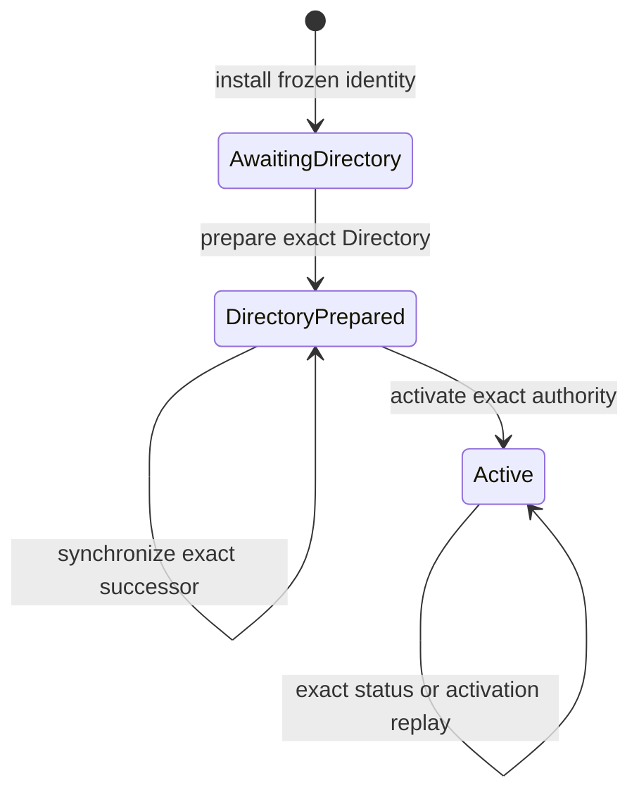
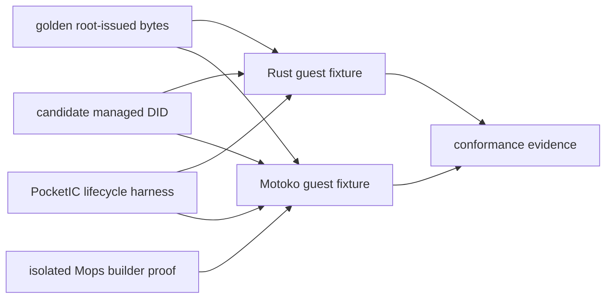

# Canic 0.109 Design: Language-Neutral Managed-Guest Feasibility

Date: 2026-08-10

## Status

- Status: proposed for maintainer approval as an M0 feasibility slice only.
- Implementation approval: none. This document defines the evidence required
  before any production ABI, configuration, runtime, builder, or package
  change may begin.
- Product-language boundary: Canic, IcyDB, every Canic infrastructure
  canister, and every existing Rust product remain Rust. This line does not
  authorize a product rewrite.
- Guest-language boundary: Motoko is considered only for application-owned
  ordinary Component and Component Child canisters.
- Release boundary: pre-1.0 release transitions remain reinstall-only. M0 may
  prove same-release restart and same-contract fixture upgrade; it must not
  introduce cross-release state migration or compatibility decoding.
- Protocol boundary: one candidate current guest contract is tested. M0 does
  not ship it, negotiate it, or retain multiple generations.
- Repository scope: Canic only. The IcyDB repository and every other sibling
  repository remain read-only.
- Publication boundary: M0 must not publish a Mops package, change the public
  `canic.toml` schema, or advertise managed Motoko support.
- Sequence: this bounded design is extracted from the broader
  [0.109 exploration](exploration.md). The exploration remains an end-state
  research record rather than implementation authority.

## Decision

0.109 begins with one executable feasibility proof for a language-neutral
managed-guest boundary. The proof must answer three questions before Canic
changes its production Rust guest protocol:

1. Can one small root-issued contract be decoded and enforced identically by a
   Rust fixture and a real Motoko fixture without hashing language-specific
   re-encodings?
2. Can Canic drive an exact, isolated, non-mutating Mops build with qualified
   tool, dependency, source, output, and transform evidence?
3. Can an explicit Motoko actor scaffold implement Canic's managed lifecycle,
   retry, conflict, restart, and same-contract upgrade invariants without
   macros or hidden source rewriting?

M0 is successful only if all three answers are demonstrated in tests and
recorded evidence. A successful M0 may justify a later implementation design.
It does not itself approve a Rust ABI hard cut, a Mops builder, a public SDK,
child provisioning, cycles requests, or an IcyDB service.

## Non-Negotiable Product-Language Boundary

This design adds no Motoko implementation of an existing Canic product.

The following remain Rust:

- `canic`, `canic-core`, `canic-macros`, `canic-host`, `canic-cli`, and
  `canic-backup`;
- Fleet Coordinator, Fleet Subnet Root, Wasm Store, and all control-plane
  policy, workflow, state, and storage;
- IcyDB's schema, planner, execution, indexes, storage, recovery, migrations,
  administrative endpoints, and any future service canister; and
- every existing Rust application or service product.

The only Motoko source permitted in M0 is a test fixture representing an
application-owned guest. A later approved integration may add a thin Motoko
guest SDK containing bounded wire types, lifecycle helpers, a root client, and
explicit scaffold support. Such an SDK remains a protocol adapter; it must not
acquire Fleet orchestration, data-runtime internals, or product business logic.

No Rust product must be translated, wrapped in Motoko, or reimplemented to
participate in a mixed Fleet.

## Why This Is a Separate Slice

The exploration describes two eventual integrations:

1. managed Motoko guest canisters; and
2. a Motoko application calling a separately deployed Rust IcyDB service.

The second depends on the first and also needs a durable cross-canister client,
root capability replay, an application-facing IcyDB service contract, and
downstream IcyDB work. Combining them would make a failed Mops or lifecycle
assumption visible only after unrelated database work had begun.

This slice therefore stops at build and managed-lifecycle feasibility. It does
not create a child canister or call IcyDB.

## Goals

M0 must:

1. Produce one candidate, language-neutral managed-guest Candid contract.
2. Produce golden root-issued byte fixtures and expected SHA-256 digests.
3. Prove Rust and Motoko decode the same frozen bytes into the same bounded
   semantic values.
4. Prove neither implementation re-encodes decoded values to establish
   deployment evidence.
5. Compile one real persistent Motoko actor that explicitly exposes the
   required lifecycle methods.
6. Exercise install, Directory preparation, synchronization, activation,
   status, exact retry, conflict, restart, and same-contract upgrade in
   PocketIC.
7. Distinguish Canic runtime activation from application-hook readiness.
8. Prove an exact Mops build can run in isolated Canic-owned staging and output
   directories without changing checked-in application source or manifests.
9. Record exact source, lockfile, tool, configuration, DID, MOST, raw Wasm,
   transformed Wasm, and release-build evidence.
10. End with an explicit go/no-go report for a later production design.

## Non-Goals

M0 does not:

- change production root or guest endpoints;
- change `CanisterInitPayload`;
- change `[roles.<role>]` or add an artifact-builder configuration;
- add a production `mops` subprocess path to `canic-host`;
- publish or reserve a public Canic Mops package name;
- support opaque or arbitrary external Wasm as a managed canister;
- add generic external build commands or shell hooks;
- implement child provisioning, cycles requests, scaling, sharding,
  authentication, metrics, or delegated tokens in Motoko;
- implement an IcyDB service, IcyDB client, SQL endpoint, or database schema;
- modify IcyDB or another repository;
- migrate or upgrade an installation from another Canic release;
- claim hostile-code sandboxing or runtime attestation; or
- promise production Motoko support.

## Current Baseline

The current Canic surface is Rust-specific at each source edge:

- [`RoleDeclaration`](../../../crates/canic-core/src/config/schema/role.rs)
  contains one Cargo package path.
- [`canister_build::artifact`](../../../crates/canic-host/src/canister_build/artifact.rs)
  qualifies Cargo evidence and invokes `cargo build` for
  `wasm32-unknown-unknown`.
- [`CanisterInitPayload`](../../../crates/canic-core/src/dto/abi/v1/payload.rs)
  exposes Rust-owned authority and deployment records.
- [non-root endpoint macros](../../../crates/canic/src/macros/endpoints/nonroot.rs)
  emit the current prepare, status, synchronize, and activate methods.
- [non-root lifecycle macros](../../../crates/canic/src/macros/start.rs) own
  initialization, post-upgrade validation, and deferred application hooks.
- [root capability DTOs](../../../crates/canic-core/src/dto/capability/mod.rs)
  already provide useful request identity, issue-time, TTL, proof, and response
  structure, but remain coupled to the complete Rust request and error graph.

The Wasm Store, release-set installation, Component Registry, Directory,
backup, and restore paths already operate on artifacts, principals, hashes, or
snapshots. M0 must not replace those language-neutral foundations.

## Trust Model

### Trusted Parties

M0 assumes:

- the operator selects the application source and lockfile;
- the qualified Mops and Motoko compiler binaries perform their documented
  behavior;
- the Rust and Motoko fixture sources are inspectable application code; and
- Canic's existing root and test harness remain authoritative for expected
  identity and lifecycle commands.

### What Qualification Proves

Build qualification may prove:

- which source, dependency lock, tools, flags, generated inputs, and transforms
  produced an artifact;
- that the artifact exposes a compatible Candid surface; and
- that the tested artifact returned status consistent with expected lifecycle
  commands.

It does not prove that arbitrary application code is honest. A malicious guest
can expose the correct DID and lie in status. The root's independent checks are
consistency checks against trusted, qualified application code; they are not
remote attestation.

The Fleet Subnet Root is the only deployment authority recognized by Canic.
That wording does not claim that IC platform mechanics prevent an application
canister from making management-canister calls or creating out-of-band
canisters with its own authority and cycles. Such canisters are outside the
Canic Registry and receive no managed status.

## Candidate Guest-Contract Rules

M0 freezes a candidate contract only inside conformance fixtures. The contract
does not become a public compatibility promise.

### One Current Contract

- The candidate has one exact ABI revision value.
- The host, root fixture, Rust guest, and Motoko guest accept only that value.
- No minimum/maximum negotiation, alternate decoder, fallback, or format
  guessing is permitted.
- Contract types use unversioned current names. The revision is evidence for
  exact mismatch rejection, not permission to run parallel generations.
- A later production hard cut removes the superseded Rust ordinary-guest ABI
  in one release if and only if a separate implementation design is approved.

### Root-Issued Frozen Bytes

Every root-issued authority payload follows this conceptual wrapper:

```candid
type FrozenPayload = record {
  bytes : blob;
  sha256 : blob;
};
```

The root fixture:

1. constructs one bounded semantic payload;
2. encodes it once;
3. computes SHA-256 over those exact bytes;
4. durably retains the bytes and digest before dispatch; and
5. sends the wrapper to the guest.

The guest:

1. checks the exact endpoint-specific byte ceiling;
2. checks that `sha256` is exactly 32 bytes;
3. recomputes SHA-256 over `bytes` and compares it;
4. decodes `bytes` into the one expected semantic type;
5. validates every interpreted field and cross-field invariant;
6. stores the original bytes and digest unchanged; and
7. uses the decoded view without re-encoding it for evidence.

This rule applies to candidate initialization, Directory authority, direct
children, and activation authority. It follows Motoko's explicit warning that
different valid Candid blobs may encode the same value and that `to_candid`
output must not be used for equality or hashing.

### Interpreted Identity

Convenience fields such as App, role, root, parent, install ID, and
release-build ID must have one source of authority. M0 must not accept an outer
convenience field that can disagree with the frozen inner binding.

The candidate contract must choose one of these forms:

- derive every interpreted identity field from the decoded frozen payload; or
- carry a compact interpreted summary inside the frozen payload and require
  the root fixture to compare it with its complete authoritative record before
  dispatch.

M0 rejects duplicate unbound identity fields.

### Guest-Issued Requests Are Different

The frozen-byte rule is for root-issued evidence. A future request originating
in Motoko must not claim that its `to_candid` encoding is canonical evidence.

For future child or cycles requests, the root must:

- decode the request under the canonical Candid type;
- bind one exact caller-owned request ID to the complete semantic request
  before effects;
- compare exact typed fields on replay; and
- retain an exact response receipt under bounded acknowledgement and garbage-
  collection rules.

Those request and receipt semantics are outside M0. This distinction prevents
the root-issued frozen-byte rule from being incorrectly copied onto
guest-originated data.

### Interface Conformance

M0 must produce one canonical required DID fragment and define:

- exact method names;
- query/update annotations;
- exact argument and result types;
- fixed numeric widths;
- blob and collection bounds enforced by each implementation;
- one compact diagnostic result shape; and
- whether the actual application service must be a Candid subtype or
  supertype of the required fragment.

Application methods may be additional methods. Conformance operates on a
parsed Candid service, not textual order or whitespace. The evidence record
retains both:

- a canonical hash of the extracted managed subset; and
- a hash of the complete emitted application DID.

M0 must prove the chosen subtyping direction with a passing extra-method
fixture and failing type, annotation, and missing-method fixtures.

## Lifecycle Model

The candidate runtime has three Canic topology phases:



Each mutating transition must:

- authenticate the exact root caller;
- validate the complete frozen command before mutation;
- retain one operation ID and complete request identity;
- return the retained result on exact replay;
- reject conflicting operation reuse without mutation; and
- make status independently observable after response loss.

`Active` means that Canic's topology and Directory invariants are active. It
does not by itself claim that application initialization completed.

### Application Hook Readiness

M0 models application hook readiness separately:

```text
NotScheduled -> Scheduled -> Ready
                         \-> Failed
```

The fixture must show which state is durable and which is only observable
during the current canister lifetime. If an install hook can trap after Canic
activation, status must not report application readiness.

M0 may reproduce the current Rust at-most-once scheduling boundary, but it must
report the consequence explicitly. It must not claim automatic hook recovery
unless a durable retry protocol is separately designed and tested.

### Upgrade Boundary

M0 may test a same-contract fixture upgrade solely to prove:

- stable guest state remains valid;
- the candidate `.most` is compatible;
- post-upgrade validates the retained exact contract and phase; and
- an Active guest schedules only the upgrade hook, not the install hook.

This is not a cross-release Canic upgrade. The pre-1.0 release boundary remains
reinstall-only.

## Mops Build Feasibility

The authoritative proof uses distinct planes so qualification, dependency
acquisition, compilation, and publication cannot blur together.

```text
read-only source + lock
        |
        v
qualification record
        |
        v
Canic-owned dependency/tool cache
        |
        v
isolated staged project + generated package
        |
        v
isolated raw Mops outputs
        |
        v
verified Canic artifact namespace
```

### Exact Tool Authority

M0 records and verifies exact versions and executable hashes for:

- the Mops CLI;
- `moc`;
- any tool Mops invokes for the accepted path; and
- any Canic-owned post-build transform.

A supported version range is insufficient evidence for a reproducible build.
The fixture's `[toolchain]` must pin `moc` exactly.

Mops optimization is disabled during M0. Current Mops may auto-select an
unpinned `wasm-opt` and treats some optimizer failures as soft failures. Canic
must retain one explicit transform owner rather than accept environment-
dependent optimization.

### Source Qualification

Before invoking Mops, M0 validates that:

- `mops.toml` and `mops.lock` are contained regular files;
- the selected `[canisters.<name>]` entry occurs exactly once;
- its main source and relevant local dependency paths are contained;
- symlinks cannot escape the admitted fixture root;
- the lockfile is present and current;
- the Canic SDK dependency, if prototyped, is exact;
- all relevant files fit bounded count and byte ceilings; and
- build flags do not enable an unqualified optimizer or path escape.

### Dependency Acquisition

`mops install --lock check` may populate a Canic-owned tool/dependency cache
under an explicitly networked acquisition step. It must not silently update
the lockfile or application manifest.

The subsequent authoritative build receives the admitted cache and performs no
dependency resolution. M0 records whether current Mops can enforce this
boundary. If it cannot, the result is a blocker rather than permission to
weaken provenance.

### Isolated Staging

M0 copies only admitted fixture inputs into a temporary Canic-owned staging
directory. Generated build identity is added only there.

The checked-in application source imports a reserved package such as
`mo:canic-generated/Config`. M0 must prove one exact compiler/package-mapping
mechanism for supplying it without editing checked-in source, `mops.toml`, or
`mops.lock`.

If current Mops cannot support that mapping safely, M0 fails this requirement.
It must not fall back to hidden source rewriting.

### Explicit Scaffold

The application owns an explicit actor source. M0 does not attempt macro-like
endpoint injection.

The fixture uses a checked-in scaffold that:

- imports the candidate SDK/runtime module;
- declares the stable guest state explicitly;
- forwards the required managed lifecycle endpoints;
- calls explicit application hooks; and
- leaves application endpoints visibly owned by the actor.

A future developer command may generate an initial scaffold as an explicit
source-generation action. The authoritative build never regenerates or
rewrites it implicitly.

### Build and Output

M0 invokes the exact equivalent of:

```sh
mops install --lock check
mops check <canister>
mops build <canister> --output <isolated-output>
```

The final flags are not decided by this illustrative command. M0 must qualify
the exact pinned Mops syntax and Motoko flags before recording a baseline.

The build must produce:

- one raw Wasm module;
- one generated DID;
- one MOST stable signature;
- complete stdout/stderr and exit status; and
- no change to the source-tree fingerprint.

Canic then applies its own admitted metadata and shrink policy in a separate
step and records raw and transformed hashes independently. Publication into a
canonical artifact namespace occurs only after every check succeeds.

Mops documents that `mops build` emits Wasm, DID, and MOST and supports an
explicit output directory. M0 qualifies those facts against the exact pin; it
does not treat changing online documentation as a durable contract.

## M0 Fixture Architecture



The Rust fixture is not a migrated product. The Motoko fixture is not a Canic
product. Both are disposable conformance implementations of the candidate
contract.

## Repository Placement

M0 may add only test and design assets inside the Canic repository:

- candidate DID and golden vectors under this design directory or a dedicated
  conformance-fixture directory;
- a minimal Rust conformance fixture under existing Canic testing ownership;
- a minimal Motoko fixture under a testing fixture directory;
- host-side qualification/build experiments behind test-only or explicitly
  experimental entry points; and
- PocketIC tests under existing testing ownership.

M0 must not add a production Canic crate solely for the protocol. If a later
implementation requires a provider-neutral protocol crate or published Mops
package, that ownership decision belongs to the later implementation design.

Generated dependencies, staged source, compiler output, and temporary evidence
must live under Canic-owned ignored build or temporary directories. They are
not checked into application source directories.

## Validation Matrix

### Wire and Hashing

- Rust and Motoko decode identical root-issued bytes.
- Both calculate the expected SHA-256 over those bytes.
- A one-byte payload change, digest change, short digest, and oversize blob
  fail without mutation.
- Two different valid Candid encodings of one semantic value remain different
  byte identities.
- No guest code hashes its own re-encoding of decoded root evidence.
- Duplicate interpreted identity fields cannot disagree.

### Lifecycle

- Non-root callers cannot prepare, synchronize, activate, or inspect protected
  status.
- Install retains the frozen identity before any hook or outbound call.
- Prepared guests run no application hook or timer.
- Exact mutation replay returns the retained status.
- Conflicting operation or authority reuse does not mutate state.
- Response loss is reconciled through independent status.
- Activation is one-way.
- Application readiness is false until the hook boundary completes.
- A hook failure cannot be reported as ready.
- Restart preserves exact phase and evidence.
- Same-contract upgrade preserves state and runs only the permitted upgrade
  hook.

### Interface

- Missing managed methods fail.
- Wrong argument, result, or query/update annotations fail.
- Root-only infrastructure methods fail.
- Additional application methods pass.
- Textually reordered but semantically identical DID passes.
- The managed-subset and complete-interface hashes are deterministic.

### Build and Supply Chain

- Missing, stale, or changed `mops.lock` fails.
- Unpinned or wrong `moc` fails.
- Wrong Mops CLI or executable hash fails.
- Unknown canister name fails.
- Source, local dependency, generated-package, and output path escapes fail.
- Symlink escapes fail.
- An unqualified `[optimize]` path fails.
- Dependency acquisition cannot rewrite the source manifest or lockfile.
- The authoritative build cannot resolve a new dependency.
- Repeated builds from identical admitted inputs produce identical raw Wasm,
  DID, MOST, and evidence hashes, or M0 records a reproducibility blocker.
- Source-tree fingerprints are identical before and after the build.
- Partial or failed outputs never enter the canonical artifact namespace.

### Product Boundary

- No production Canic or IcyDB source moves to Motoko.
- No existing Rust role is replaced by the Motoko fixture.
- No production configuration accepts `builder = "mops"`.
- No public package is published.
- No sibling repository is modified.

## M0 Execution Plan

### M0.1 — Freeze the Candidate Contract

- inventory the exact current Rust lifecycle semantics;
- write the candidate required DID fragment;
- freeze all size and collection limits;
- define diagnostic and status shapes;
- define the exact ABI-revision rejection rule; and
- create golden root-issued bytes and digest vectors.

Exit: the contract is reviewable without Rust type aliases or internal DTOs.

### M0.2 — Prove Two Decoders

- implement a minimal Rust decoder/state machine fixture;
- implement a minimal Motoko decoder/state machine fixture;
- run the shared golden vectors; and
- prove frozen-byte storage and no re-encoding evidence.

Exit: both implementations agree on values, hashes, limits, and failures.

### M0.3 — Prove the Mops Boundary

- pin exact Mops and `moc` tools;
- qualify manifest, lock, canister, and contained source paths;
- separate dependency acquisition from build;
- inject generated identity only into isolated staging;
- build into an isolated output directory; and
- record reproducibility and non-mutation evidence.

Exit: the builder proof is exact or records a blocker.

### M0.4 — Prove Managed Lifecycle

- install both fixtures in PocketIC;
- run prepare, synchronize, activate, and status;
- inject exact replay, conflicts, response loss, restart, and hook failure;
- run a same-contract upgrade; and
- compare externally observable behavior.

Exit: the fixtures satisfy one lifecycle matrix without a language branch in
the harness policy.

### M0.5 — Publish the Decision Record

The M0 report must state:

- exact tool and fixture revisions;
- complete contract and limits;
- reproducibility result;
- scaffold and generated-package mechanism;
- Rust/Motoko behavioral differences, if any;
- security and trust conclusions;
- production changes that would be required next;
- estimated Wasm and maintenance cost of the Motoko adapter; and
- a go/no-go recommendation.

Exit: no implementation work remains hidden behind an exploratory claim.

## Approval Gates

A later production design remains on HOLD until M0 proves all of these:

1. The explicit scaffold compiles without implicit source rewriting.
2. Generated build identity is injected without changing checked-in source,
   `mops.toml`, or `mops.lock`.
3. The exact Mops build is isolated and source-non-mutating.
4. Rust and Motoko pass the same frozen-byte and lifecycle fixtures.
5. DID subset validation is semantic and directionally correct.
6. Application readiness cannot be confused with Canic activation.
7. The trust model is accepted without claiming sandboxing or attestation.
8. The M0 report recommends proceeding and the maintainer explicitly approves
   the next slice.

Failure of a gate is a valid M0 outcome. It does not authorize a fallback
generic shell builder, opaque managed Wasm, source rewriting, or a Motoko
rewrite of any product.

## Held Work

The following remain outside 0.109 M0 even if feasibility succeeds:

- production hard cut of the ordinary Rust guest ABI;
- tagged Cargo/Mops role configuration;
- production Mops builder and provenance storage;
- public Canic Mops SDK or scaffold command;
- durable guest `ensureChild`;
- guest cycles requests;
- replay receipt acknowledgement and garbage collection;
- Motoko health, metadata, metrics, authentication, scaling, or sharding;
- IcyDB service facade and generated Motoko client;
- schema-specific database service examples; and
- production mixed-Fleet backup and restore claims.

Each requires a later bounded design after M0 evidence exists. IcyDB remains
Rust in every later slice.

## Exit Criteria

0.109 M0 is complete only when:

- the candidate contract and golden vectors are checked in;
- real Rust and Motoko fixtures pass the same conformance matrix;
- the Mops build proof is exact, isolated, reproducible, and source-
  non-mutating;
- the explicit scaffold and generated identity mechanism are demonstrated;
- PocketIC proves lifecycle, replay, conflict, restart, hook-readiness, and
  same-contract upgrade behavior;
- the product-language and repository-scope audits pass;
- the report lists every unresolved blocker and production change; and
- no production behavior or public support claim has changed.

Passing M0 means only that a production integration is technically credible.
It does not mean managed Motoko support has shipped.

## Research Sources

- [0.109 end-state exploration](exploration.md)
- [Motoko Candid serialization warning](https://docs.internetcomputer.org/languages/motoko/icp-features/candid-serialization/)
- [Motoko persistence and stable signatures](https://docs.internetcomputer.org/languages/motoko/fundamentals/actors/data-persistence/)
- [Mops build outputs and isolated output option](https://docs.mops.one/cli/mops-build)
- [Mops install lockfile behavior](https://docs.mops.one/cli/mops-install)
- [Mops manifest, toolchain, canister, and optimizer behavior](https://docs.mops.one/mops.toml)
- [Candid language-neutral interfaces](https://docs.internetcomputer.org/guides/canister-calls/candid/)

External tool behavior was inspected on 2026-08-10. M0 must re-qualify the
exact selected pins rather than treating online documentation as immutable
evidence.
