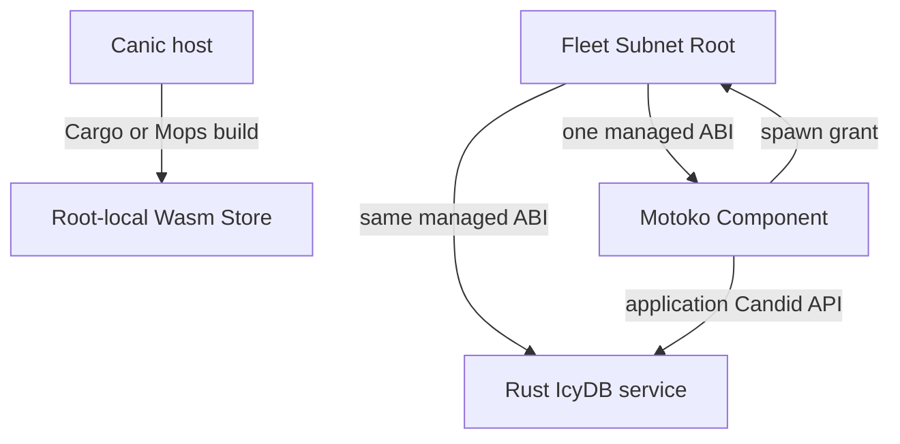
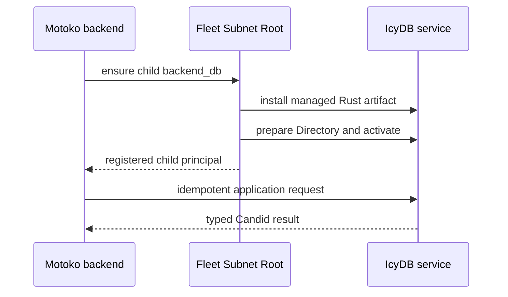

# Motoko Managed Canisters and an IcyDB Service Path

Date: 2026-08-10

## Status

Exploration only. None of the configuration, SDK, ABI, commands, or IcyDB
service surfaces in this document are implemented or approved release
requirements.

The first bounded feasibility slice is specified separately in the
[0.109 language-neutral managed-guest design](0.109-design.md). That design
does not approve the broader end state described here.

This exploration responds to a concrete community need: a Motoko canister
should be able to participate as a fully managed Canic Component, and a Motoko
application should be able to ask its Fleet Subnet Root for a separately
deployed IcyDB-backed data service with very little application code.

Do not publish a Canic Mops package from this document alone. The current
root/runtime protocol and host builder must change first; an SDK that merely
mirrors today's Rust internals would advertise support that Canic cannot yet
provide safely.

Non-negotiable product-language boundary: this work does not rewrite Canic,
IcyDB, or any existing Rust product in Motoko. Motoko is admitted only as a
guest language for application-owned Components. Canic infrastructure,
orchestration, host tooling, control planes, data runtimes, and existing
product canisters remain in their current implementation language.

## Verdict

Both goals are feasible, but they are two distinct integrations:

- Canic needs one language-neutral managed-canister ABI and a Mops artifact
  builder. The Wasm Store and installation machinery already handle Wasm bytes
  without caring which language produced them. The current role qualification,
  build, initialization, lifecycle, and child-request paths remain
  Rust/Cargo-specific.
- IcyDB should remain a Rust data runtime and be deployed as a separate
  Canic-managed service canister. A Motoko application should call that service
  over Candid through a small client package. Reimplementing IcyDB in Motoko
  would duplicate its schema, planner, indexing, stable-memory, recovery, and
  migration authorities.

The recommended end state is:



The root remains the only deployment and Registry authority. The Motoko
application is the IcyDB service's registered parent and application caller;
it does not become the service canister's controller.

## Product-Language Boundary

This exploration adds an interoperability lane; it is not a product rewrite
programme.

The following remain Rust:

- Canic host, CLI, backup, runtime facade, core, macros, Fleet Coordinator,
  Fleet Subnet Root, Wasm Store, and control-plane implementation;
- IcyDB schema, planner, execution, indexing, storage, recovery, migration,
  administrative endpoints, and service implementation; and
- every existing Rust application or service product unless its owner starts a
  separate, explicitly approved project unrelated to this design.

The only Motoko code Canic may own under this exploration is the minimum
interoperability surface required for a Motoko application-owned guest:

- bounded wire types for the language-neutral guest ABI;
- a small lifecycle state machine implementing that ABI;
- a root client for admitted guest capabilities;
- generated or checked scaffold code; and
- conformance fixtures and examples.

That code must not acquire Fleet orchestration, control-plane policy, IcyDB
internals, product business logic, or an independent implementation of any
existing Rust subsystem. A Rust product can participate in the same mixed
Fleet without being translated, wrapped in Motoko, or reimplemented.

## What Is Already Language-Neutral

Several important foundations do not need to be rebuilt:

- Motoko compiles to ordinary IC Wasm.
- Candid calls are language-neutral.
- Canic's application artifact union, root release sets, chunk manifests, Wasm
  Store, module hashes, root-owned installation, Component Registry,
  Directories, backup snapshots, and restore snapshots operate on canister
  identities or artifact bytes rather than Rust source.
- The root already accepts a registered Component member's bounded request to
  provision one admitted direct child.
- IcyDB already documents coexistence with a Canic endpoint in the same Rust
  canister and exposes its runtime through explicit endpoint declarations.

These are the useful seams. The work should open the source and runtime edges
around them, not introduce a second Motoko-only orchestration system.

## Current Blocking Boundaries

| Boundary | Current authority | Why Motoko is blocked | Required change |
| --- | --- | --- | --- |
| Role declaration | `roles.<role>.package` points to a Cargo package. | A Mops canister has no Cargo manifest. | Replace the package-only field with one tagged artifact-builder declaration. |
| Role qualification | `canic-host::role_contract` requires Cargo metadata and one direct normal `canic` dependency. | A Mops dependency graph cannot satisfy the Cargo contract. | Give each builder its own evidence producer and converge on one language-neutral role contract. |
| Build execution | `canister_build` always runs `cargo build --target wasm32-unknown-unknown`. | Canic cannot invoke or qualify `mops build`. | Add a first-class, pinned Mops builder; do not use an arbitrary shell hook. |
| Build identity | Rust build scripts embed App, role, config, and release-build identity. | Motoko has no `build.rs` or Rust environment macros. | Supply a Canic-generated Motoko package during the authoritative Mops build. |
| Init ABI | Managed non-roots decode Rust-owned `CanisterInitPayload` plus application bytes. | The full type graph is large and couples the guest to Canic internals. | Hard-cut ordinary canisters to a compact, versioned guest init envelope. |
| Directory evidence | Rust re-encodes typed Candid values before hashing. | Motoko explicitly does not promise deterministic `to_candid` bytes. | Hash the exact opaque bytes frozen by the root; never hash a Motoko re-encoding. |
| Runtime endpoints | Rust macros emit prepare, status, synchronize, and activate endpoints backed by `canic-core` stable state. | A Motoko package has no macros and no implementation. | Publish a small Mops runtime state machine plus a generated actor scaffold. |
| Child provisioning | Rust constructs the complete root capability envelope and decodes the public Rust error. | Motoko has no maintained client binding or durable helper. | Move both Rust and Motoko callers to one compact, versioned guest request/response ABI. |
| Feature qualification | Cargo features prove auth, metrics, and control-plane capabilities. | Mops has no equivalent feature evidence. | Admit a deliberately small Motoko capability profile first and reject unsupported config. |
| Candid checks | Local Rust builds extract Candid from debug Wasm. | Mops already emits `.did` directly. | Require the Mops `.did` and check its managed subset against Canic's canonical ABI. |

Relevant current owners include:

- [`CONFIG.md`](../../../CONFIG.md)
- [`crates/canic-host/src/role_contract/package/mod.rs`](../../../crates/canic-host/src/role_contract/package/mod.rs)
- [`crates/canic-host/src/canister_build/artifact.rs`](../../../crates/canic-host/src/canister_build/artifact.rs)
- [`crates/canic-core/src/dto/abi/v1/payload.rs`](../../../crates/canic-core/src/dto/abi/v1/payload.rs)
- [`crates/canic/src/macros/endpoints/nonroot.rs`](../../../crates/canic/src/macros/endpoints/nonroot.rs)
- [`crates/canic-core/src/ops/component_runtime.rs`](../../../crates/canic-core/src/ops/component_runtime.rs)
- [`crates/canic-core/src/ops/rpc/request/dispatch.rs`](../../../crates/canic-core/src/ops/rpc/request/dispatch.rs)

## Do Not Treat Opaque Wasm as Fully Managed

Adding `external_wasm = "backend.wasm"` would let Canic hash, store, and
install a Motoko artifact. It would not make the canister managed.

Without the runtime ABI, the root cannot:

- independently observe the installed canister's protected binding;
- prepare or synchronize its Fleet and Component Directories;
- activate the runtime under exact Directory evidence;
- authorize it as a registered caller of root child-provisioning RPC;
- prove same-release retry and interruption behavior; or
- give it the same readiness and operational semantics as Rust Components.

External Wasm remains useful for an explicitly observed or externally managed
role, but that is a different product contract. It must not be presented as
Motoko support for a managed Fleet.

## Recommended Hard Cut: One Guest ABI

Canic should not maintain a Rust runtime protocol and a Motoko runtime
protocol. Ordinary Rust and Motoko Components should both use one compact,
language-neutral guest ABI. Rust's `canic` crate and the proposed Motoko
package become two implementations of that ABI.

The Fleet Coordinator, Fleet Subnet Root, and Wasm Store remain canonical Rust
infrastructure artifacts. The guest ABI applies only to ordinary Component and
Component Child roles.

### Why a Hard Cut Is Better

- Root provisioning keeps one prepare/status/synchronize/activate flow.
- All managed guests return the same evidence shape.
- PocketIC tests exercise one root policy rather than a language branch.
- Future CDKs can implement the same contract without another root mode.
- The current pre-1.0 reinstall-only policy permits removal of the old ordinary
  runtime ABI instead of retaining adapters or compatibility decoding.

The cut should happen in a named future release line after the current 0.101
closeout. This document does not allocate or renumber an existing 0.102-0.108
design.

## Wire Rule: Hash Frozen Bytes, Not Re-Encoded Values

The most important cross-language rule is:

> The root encodes and durably freezes a payload once. The guest receives those
> exact bytes, validates their byte length and SHA-256 digest, stores the exact
> bytes, and echoes the same bytes or digest in status. A guest never decodes a
> value and re-encodes it to derive deployment evidence.

Motoko provides `to_candid` and `from_candid`, but its documentation warns that
several valid Candid byte encodings can represent the same value and that
`to_candid` output must not be used for equality or hashing. Canic's current
`ComponentRuntimeOps` hashes a Rust Candid re-encoding, so copying that code
into Motoko would create a fragile cross-language consensus rule.

A conceptual boundary type is:

```text
type Digest32 = blob;

type HashedPayloadV1 = record {
  bytes : blob;
  sha256 : Digest32;
};
```

Validation must require an exact 32-byte digest, an endpoint-specific byte
limit, and `sha256(bytes) == sha256`. The outer Candid value is transport only;
the inner byte string is the evidence identity.

## Compact Guest Initialization

The current complete Canic binding and deployment records remain authoritative
inside the root and Registry. A guest does not need to compile the entire Rust
type graph to prove it received those records.

A future init envelope should carry only the fields the guest must interpret,
plus hash-bound opaque authority:

```text
ManagedGuestInitV1 {
  abi_version,
  install_id,
  release_build_id,
  app,
  role,
  root,
  parent,
  binding: HashedPayloadV1,
  deployment: HashedPayloadV1,
  application_init_args,
}
```

Required invariants:

- `abi_version` is one exact supported version, not a negotiated range.
- IDs and digests use bounded blobs with exact lengths.
- `root` is the only caller accepted by lifecycle commands.
- `parent` is the application-level parent used for child and service access
  checks; it is not controller authority.
- `binding` and `deployment` are exact root-frozen bytes. The root can decode
  and compare them independently; the guest validates and retains their
  hashes.
- `application_init_args` stay dormant until the first exact activation, as
  they do in the Rust runtime today.
- Fresh install persists the envelope before any application hook or outbound
  call.
- Post-upgrade validates the stable envelope and phase before scheduling user
  code.

The init envelope should replace the ordinary Rust init signature in the same
hard cut. It should not be added as an optional alternate decoder.

## Compact Directory and Activation State

The guest runtime needs three durable phases:

- `AwaitingDirectory`
- `DirectoryPrepared`
- `Active`

It also needs one exact current Directory payload, a bounded direct-child
projection, their digests, and optional activation evidence. That is the same
semantic state Canic already owns, expressed without exporting internal Rust
records as the guest implementation contract.

Conceptual commands:

```text
GuestDirectoryCommandV1 {
  operation_id,
  authority: HashedPayloadV1,
  direct_children: HashedPayloadV1,
}

GuestActivationCommandV1 {
  operation_id,
  authority_sha256,
}
```

The maintained endpoint names can remain the current lifecycle names if the
old argument and response types are hard-cut at once:

```text
canic_component_runtime_directory_prepare
canic_component_runtime_status
canic_component_runtime_directory_synchronize
canic_component_runtime_activate
```

Status should return the exact stored init identity, phase, payloads or their
required exact evidence, and activation receipt. The root must continue its
current pattern of observing status independently after a mutating call.

Activation is one-way. Exact replay returns the retained `Active` status and
must not run the application install hook twice. A conflicting operation,
authority digest, or payload is rejected without mutation.

## Compact Guest Root Requests

The current capability endpoint is Candid, but the Rust client owns request
construction, replay metadata, response decoding, and the full public Canic
error type. A cross-language ABI should narrow this to the operations ordinary
guests actually need.

Initial request set:

```text
GuestRequestV1 {
  CreateChild { role, application_init_args }
  RequestCycles { amount }
}
```

The envelope must retain:

- exact ABI version;
- caller-bound request ID;
- issue time and bounded TTL;
- structural proof mode;
- one exact response receipt for replay; and
- compact diagnostic failure, preferably using the maintained diagnostic-code
  authority if that design has shipped before this work starts.

The Rust facade should move to this same request shape. Do not add a
Motoko-only `spawn_child` root endpoint beside a permanently retained Rust
capability endpoint.

The SDK should expose both a low-level request and a durable `ensureChild`
helper. `ensureChild` must persist its pending operation before `await`, reuse
the same request identity after interruption, and retain the returned child
principal before acknowledging completion. A convenience function that makes
a fresh request on every retry is not sufficient for production.

## Role Configuration Hard Cut

The role source should describe how an artifact is built, not claim a source
language as runtime policy.

Proposed shape:

```toml
[roles.root]
kind = "root"

[roles.root.artifact]
builder = "cargo"
package = "root"

[roles.backend]
kind = "canister"

[roles.backend.artifact]
builder = "mops"
project = "backend"
canister = "backend"
```

Rules:

- `artifact` is one tagged builder declaration.
- The current bare `package` field is removed in the release that introduces
  this shape; it is not retained as an alias.
- `project` is relative to the declaring `canic.toml` and must resolve to a
  contained directory with one `mops.toml`.
- `canister` must name exactly one `[canisters.<name>]` entry in that
  `mops.toml`.
- Root roles accept only the canonical Cargo/control-plane contract.
- Ordinary Cargo and Mops roles must implement the same guest ABI.
- Prebuilt, remote URL, arbitrary command, and observed-only builders are not
  part of the managed Motoko MVP.

The topology digest must encode the builder tag and canonical builder identity
instead of a Cargo package string. Release-set entries can keep the role,
artifact path, byte size, and hashes that already become language-neutral
after the build.

## Mops Builder Contract

Canic should invoke Mops directly as a supported tool, not delegate to an
application-provided script.

### Qualification

Before effects, the builder should prove:

- `mops.toml`, `mops.lock`, the selected main source, and relevant directories
  are contained regular files/paths with no symlink escape;
- the selected canister exists exactly once;
- `moc` is explicitly pinned in `[toolchain]`;
- the supported Mops version range is satisfied;
- lockfile validation succeeds without silently updating dependencies;
- the exact Canic Mops SDK version and ABI match the Canic host version;
- no unsupported Motoko capability is enabled by the role's Canic config; and
- the source and lock evidence fit bounded provenance limits.

The authoritative build should use the equivalent of:

```sh
mops install --lock check
mops check <canister>
mops build <canister>
```

Exact command flags must follow the pinned supported Mops version rather than
being copied permanently from this exploration.

### Generated Build Identity

The authoritative build must supply a generated Motoko package containing at
least:

- App and role identity;
- Canic guest ABI version;
- Canic SDK version;
- release-build ID; and
- build network.

The project imports that package from a reserved name such as
`mo:canic-generated/Config`. Canic supplies it to `moc` through the Mops build
instead of rewriting checked-in application source. Direct `mops build` is not
an authoritative Canic artifact build, just as direct Cargo Wasm builds are
not authoritative today.

### Outputs

Mops emits `.wasm`, `.did`, and `.most` outputs. Canic should normalize these
into its existing role artifact namespace:

```text
<artifact-root>/<role>/<role>.wasm
<artifact-root>/<role>/<role>.wasm.gz
<artifact-root>/<role>/<role>.did
<artifact-root>/<role>/<role>.most
```

The `.most` file is build/upgrade evidence, not a Wasm Store payload. The
initial pre-1.0 integration remains reinstall-only across release lines, while
same-release interruption recovery remains required.

The existing optional Wasm shrink and local Candid metadata policy can be
applied after either builder produces raw Wasm. Transform evidence must not
depend on the source language.

### Interface Validation

The emitted `.did` must be parsed before the artifact enters the application
union. Canic should check that:

- every required managed endpoint exists with the exact current guest ABI;
- application methods may be additional methods;
- a root-only infrastructure surface is not exported;
- method query/update annotations match the canonical contract; and
- the checked interface hash is recorded in build provenance.

This is necessary but not sufficient: a malicious or broken canister can
expose the right Candid and implement the wrong behavior. Runtime installation
still requires independent status, phase, binding, Directory, and activation
checks.

## Proposed Motoko SDK

The SDK should be a normal versioned Mops package published only when the host
and root understand the same ABI.

Suggested package layout:

```text
src/
  Types.mo        bounded public wire types
  Digest.mo       exact SHA-256 and length validation for frozen payload bytes
  Runtime.mo      pure durable lifecycle state transitions
  RootClient.mo   child/cycles request envelopes and response decoding
  Child.mo        durable ensure-child helper
  Directory.mo    read-only direct-child and service discovery views
```

Motoko has no Rust-style procedural macros, so the package alone cannot inject
actor lifecycle functions and public endpoints. Canic should also provide a
small generated scaffold. The application-owned actor remains explicit and
reviewable.

Conceptual application shape:

```motoko
import Canic "mo:canic";
import Generated "mo:canic-generated/Config";

shared ({ caller = installer }) persistent actor class Backend(
  init : Canic.ManagedGuestInitV1
) {
  var canicState = Canic.Runtime.install(Generated.contract, installer, init);

  public shared ({ caller }) func canic_component_runtime_directory_prepare(
    command : Canic.GuestDirectoryCommandV1
  ) : async Canic.Result<Canic.GuestRuntimeStatusV1> {
    Canic.Runtime.prepare(canicState, caller, command)
  };

  // Status, synchronize, and activate wrappers are generated here.
  // Application methods remain below the managed boundary.
}
```

The final syntax must be compiled against the pinned Motoko toolchain; this is
an architectural sketch, not copyable current code.

### Lifecycle Hooks

The scaffold should expose explicit application hooks:

```text
canicSetup()
canicInstall(application_init_args)
canicUpgrade()
```

Required behavior:

- no application hook or timer runs while `Prepared`;
- first exact activation commits `Active` before scheduling setup/install;
- setup/install are scheduled after the lifecycle response boundary;
- exact activation replay never schedules install again;
- post-upgrade validates Canic state before scheduling setup/upgrade; and
- hooks are documented as idempotent because a trap after scheduling can still
  require application-level recovery.

### Initial Capability Profile

The first Motoko release should be intentionally narrow:

- managed init, Directory, activation, status, direct-child discovery;
- bounded child provisioning;
- cycles request;
- health/readiness/metadata sufficient for Canic operators; and
- application endpoints owned by the Motoko actor.

Initially reject Motoko roles that request:

- Fleet Subnet Root or control-plane behavior;
- delegated-token issuer or verifier behavior;
- role-attestation caches;
- Canic stable-memory allocation descriptors;
- Rust-only endpoint macros; or
- scaling/sharding helpers whose durable client state machine has not yet been
  ported and proven.

Add capabilities only with cross-language fixtures and one clear owner. Do not
turn unimplemented options into silent no-ops.

## IcyDB: Use a Service Canister, Not a Port

IcyDB currently is a schema-first Rust persistence/query runtime embedded into
the canister that owns the data. It is not a generic database server, and its
current DDL surface does not create arbitrary entity tables from nothing.
Schemas, stores, entities, memory ranges, and generated adapters originate in
Rust schema declarations.

Therefore, a Motoko application has three possible paths:

| Path | Assessment |
| --- | --- |
| Port IcyDB internals to Motoko | Reject. It creates two databases with drifting storage, schema, migration, planner, and recovery semantics. |
| Deploy one completely generic SQL canister | Not a faithful fit today. IcyDB is schema-first, and arbitrary `CREATE TABLE` is not the current schema-authoring surface. |
| Deploy a schema-specific Rust IcyDB service and call it from Motoko | Recommended. It reuses IcyDB's single runtime authority and IC's language-neutral Candid boundary. |

The service is an ordinary Canic-managed Rust child in the Motoko Component's
catalog. The Motoko Component asks its root to ensure the child exists, then
stores and calls the returned principal.

### IcyDB Service Topology

Example future config using the proposed builder shape:

```toml
[roles.root]
kind = "root"

[roles.root.artifact]
builder = "cargo"
package = "root"

[roles.backend]
kind = "canister"

[roles.backend.artifact]
builder = "mops"
project = "backend"
canister = "backend"

[roles.backend_db]
kind = "canister"

[roles.backend_db.artifact]
builder = "cargo"
package = "backend_db"

[component_specs.backend]
component_role = "backend"
maximum_instances = 1

[component_specs.backend.children.backend_db]
kind = "singleton"

[component_specs.backend.spawn_grants.backend.backend_db]
maximum_instances_per_parent = 1
```

Application flow:



The exact current root provisioning journal remains responsible for reserve,
claim, install, Registry commit, Directory convergence, activation, response
loss, and exact replay. The Motoko SDK should not call the management canister
or install the IcyDB Wasm itself.

### IcyDB Service API

Do not expose the generated controller-gated `icydb_query`, `icydb_update`, or
`icydb_ddl` endpoints as the Motoko application's ordinary data plane. Those
are administrative surfaces, and the Motoko parent is deliberately not a
controller.

The Rust service should wrap IcyDB session APIs in application endpoints that:

- require the exact registered Canic parent caller;
- accept typed, bounded requests;
- use IcyDB's normal read/write admission and response bounds;
- carry an application operation ID for mutation replay;
- retain a bounded exact-response receipt before replying to a mutation;
- expose schema identity/version in responses where client compatibility
  matters; and
- keep controller-only schema/DDL/metrics operations separate.

Two useful service styles can coexist as templates, not runtime modes:

- **Generated typed service:** schema-specific Candid CRUD/query methods and a
  generated Motoko client. This is the safest default for community apps.
- **Parent-only reduced SQL service:** a bounded application endpoint that
  accepts the supported SQL subset and returns IcyDB's public SQL result types.
  This is convenient for trusted application code but must warn about SQL
  construction and must not become a public user-supplied SQL endpoint.

The typed service should be the first example.

### Cross-Canister Database Semantics

Moving IcyDB into a child canister changes transaction boundaries:

- one Motoko update and one IcyDB update are separate IC messages;
- there is no atomic transaction spanning both canisters;
- state before an `await` may already be committed;
- a delivered IcyDB mutation can commit even if the Motoko caller later traps
  or loses the response; and
- service reads from a canister caller normally use an update-call path, not a
  composable local-query assumption.

The integration must therefore provide idempotent mutation operation IDs and
durable retry receipts. Documentation should recommend that domain state live
in one authority where possible: either make IcyDB the source of truth for the
operation or use an explicit saga. Do not describe the service as if it were a
same-process Rust database handle.

## Ownership Split

### Canic Repository

Canic should own:

- the language-neutral guest ABI and canonical `.did`;
- Rust guest-runtime migration to that ABI;
- builder-tag config and artifact-builder qualification;
- the supported Mops builder and provenance;
- the Canic Mops SDK and generated actor scaffold;
- compact root request/response bindings;
- mixed Rust/Motoko PocketIC journeys; and
- operator docs and a minimal mixed Fleet example.

### IcyDB Repository

IcyDB should own:

- an application-facing service facade or template over IcyDB sessions;
- idempotent service mutation receipts;
- service request/result types and Candid contract;
- schema-to-Motoko client generation or checked generated bindings; and
- focused IcyDB service tests and durability semantics.

### Integration Example

One repository should host the final runnable example, but it should consume
published/pinned Canic and IcyDB surfaces rather than copy their internals. It
must prove:

```text
Rust root -> Motoko Component -> Rust IcyDB child
```

## Delivery Plan

This is large enough for a dedicated release line, not a patch inside 0.101. A
sensible sequence is seven reviewable outcomes:

1. **Guest ABI contract:** canonical `.did`, byte/digest limits, golden Rust
   fixtures, status invariants, and removal plan for the current ordinary ABI.
2. **Rust guest-ABI hard cut:** keep ordinary Components implemented in Rust
   while moving them to the guest init, Directory, activation, and compact
   root-request ABI; remove the superseded Rust protocol path.
3. **Builder authority:** hard-cut role config to tagged builders and converge
   Cargo outputs on a language-neutral qualified-artifact record.
4. **Mops build:** pinned tool discovery, lock/config qualification, generated
   build package, Wasm/DID/MOST collection, provenance, and failure tests.
5. **Motoko SDK:** runtime state machine, generated scaffold, root client,
   direct-child discovery, focused Motoko checks, and package publication
   gates.
6. **Mixed Fleet proof:** PocketIC install, Directory sync, activation, child
   provision, interruption replay, upgrade/restart, backup, and restore with a
   real Motoko Component.
7. **IcyDB service proof:** schema-specific Rust child service, generated
   Motoko client, idempotent write journey, operator guide, and runnable
   example.

If the IcyDB service work requires independent IcyDB runtime changes, outcome
7 should be a coordinated downstream line rather than expanding the Canic
implementation patch.

## Validation Matrix

### Build and Supply Chain

- Cargo and Mops roles produce the same canonical artifact record shape.
- Missing or stale `mops.lock` fails without mutation.
- Missing `moc` pin, unsupported tool version, unknown canister, and SDK/ABI
  mismatch fail before build publication.
- Project, output, and generated-package path escapes fail.
- Repeated build evidence identifies inputs, tools, transforms, DID hash, Wasm
  hash, and release-build ID.
- Production and local Candid metadata rules match current Canic policy.

### ABI

- Rust and Motoko decode the same golden init and command blobs.
- Both implementations calculate the same SHA-256 over exact frozen bytes.
- Non-32-byte digests, oversize payloads, and payload/digest mismatch fail.
- Different valid Candid encodings of the same decoded value remain different
  byte identities by design.
- Required endpoint Candid is exact and extra application methods are allowed.
- Unsupported ABI versions fail closed.

### Lifecycle

- Prepared Motoko canisters run no application hook or timer.
- Root-only lifecycle caller checks cannot be bypassed by ingress.
- Exact prepare, synchronize, activate, and status replay survive upgrade.
- Conflicting operation or Directory evidence never mutates state.
- Install hook runs once after first activation.
- Post-upgrade hook runs only for a validated Active runtime.

### Root Requests

- Only an Active registered caller with an exact spawn grant can create the
  requested role.
- Motoko request retry reuses one durable operation identity.
- Response loss returns the same child, not another child.
- Unknown, expired, conflicting, and cross-caller request IDs fail.
- Cycles funding retains existing parent and budget policy.

### IcyDB Service

- The Motoko parent can call the data API but cannot call controller-only admin
  methods.
- Other canisters and ingress callers are rejected by exact caller authority.
- The same mutation operation ID returns the same committed result after
  response loss.
- Conflicting reuse fails without a second database mutation.
- Query and response bounds are enforced.
- Schema/client mismatch is observable before an unsafe request.
- Service snapshot, Canic backup, and restore preserve the database.

## Rejected Shortcuts

### Mirror All Current Rust DTOs in Motoko

Rejected because it exposes internal type churn as the SDK contract, requires
cross-language reproduction of Rust evidence hashing, makes errors enormous,
and still lacks Cargo feature equivalents.

### Hash `to_candid` Output in Motoko

Rejected because Motoko explicitly does not guarantee a unique or stable
encoding for the same value.

### Add a Generic External Build Command

Rejected for the managed MVP because it weakens path, toolchain, input, output,
and provenance authority. Add supported builders with typed evidence.

### Let the Motoko App Control the IcyDB Canister

Rejected because application data access does not require management authority.
The root should remain controller; the service authorizes its exact registered
parent at the Candid endpoint.

### Expose Controller SQL to the Public

Rejected because IcyDB documents these as administrative surfaces. Public or
end-user access needs application-owned authorization and bounded request
shapes.

### Port IcyDB to Motoko

Rejected unless IcyDB deliberately becomes two independent implementations
with their own conformance program. It is not required for a Motoko application
to use an IcyDB service.

### Rewrite Existing Products in Motoko

Rejected. This design adds support for application-owned Motoko guests; it
does not authorize translating Canic infrastructure, IcyDB, or any existing
Rust product. The small guest SDK and scaffold are protocol adapters, not a new
implementation language for Canic products.

## Exit Criteria

Motoko support is complete only when a real mixed Fleet can prove all of the
following without manual installation:

- Canic builds and qualifies a pinned Mops canister.
- The host includes it in the exact application artifact union and admitted
  root release set.
- The root installs it from the root-local Wasm Store.
- The Motoko runtime independently retains and reports its exact protected
  identity.
- Directory preparation, synchronization, activation, retry, and restart match
  the Rust Component contract.
- The Motoko Component durably requests one admitted IcyDB child.
- The root returns the same child across response loss.
- The Motoko Component makes a typed, parent-authorized, idempotent IcyDB write
  and reads it back.
- Backup and restore preserve both canisters and their authoritative state.

Anything less should be described precisely as Mops build support, external
Wasm installation, or an experimental client—not full managed Motoko support.

## Research Sources

- [Motoko overview](https://docs.internetcomputer.org/languages/motoko/)
- [Motoko Candid serialization warning](https://docs.internetcomputer.org/languages/motoko/icp-features/candid-serialization/)
- [Motoko data persistence and stable signatures](https://docs.internetcomputer.org/languages/motoko/fundamentals/actors/data-persistence/)
- [Candid language-neutral interfaces](https://docs.internetcomputer.org/guides/canister-calls/candid/)
- [IC canister lifecycle](https://docs.internetcomputer.org/guides/canister-management/lifecycle/)
- [Mops documentation](https://docs.mops.one/)
- [IcyDB repository](https://github.com/dragginzgame/icydb)

The external behavior described here was inspected on 2026-08-10. Tool
versions and command details must be re-qualified when this idea is promoted
to an active implementation design.
