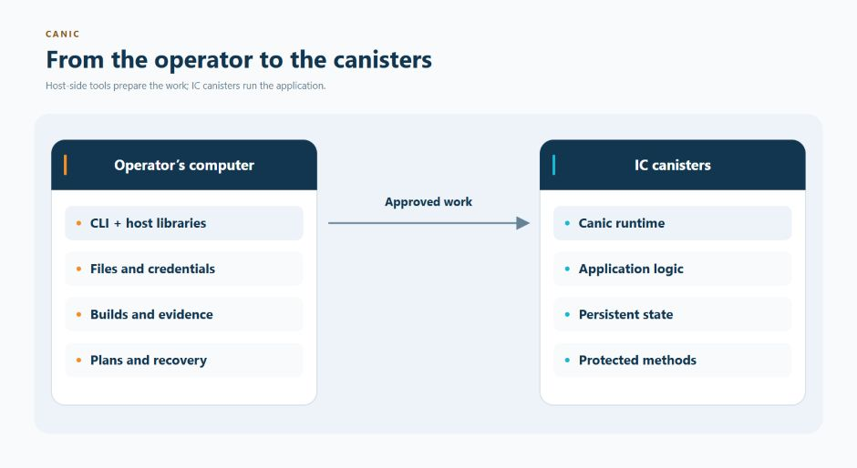
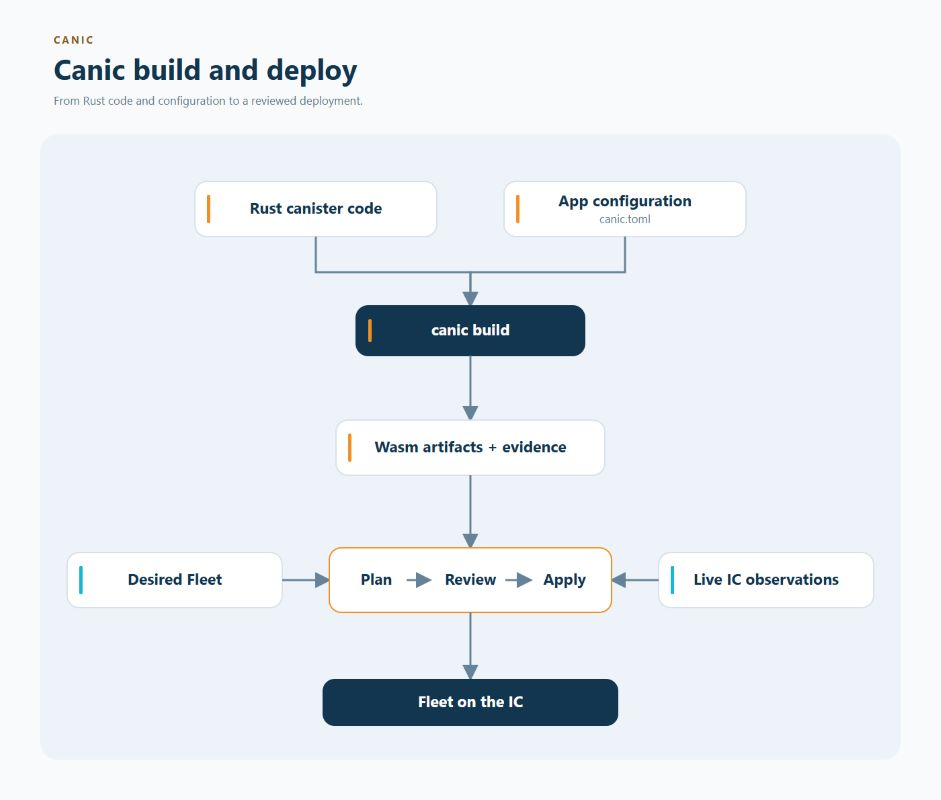
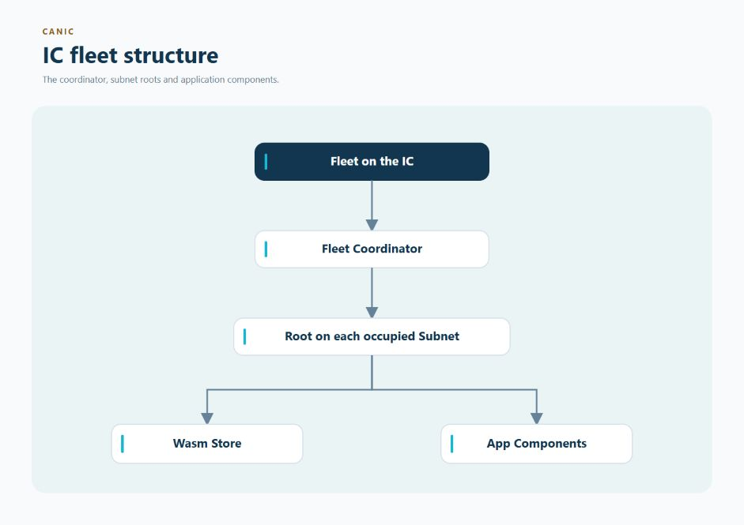

# How Canic Works

Canic is the application framework and operations layer for Rust applications
made from multiple Internet Computer canisters.

This guide explains the problem Canic solves, how its pieces fit together, and
the terms used throughout the rest of the documentation.

## Why Use Canic?

An individual canister combines program code with persistent data. A real
application often needs several of them: an API, user or data shards, indexes,
workers, storage gateways, and management infrastructure.

 

Without a shared application model, each canister may be easy to understand
while the system as a whole becomes difficult to operate. The operator still
needs answers to questions such as:

- Which exact Wasm belongs in each canister?
- Which canisters are allowed to create or call one another?
- Where may they run, and how many may exist?
- How are they funded without losing or double-spending cycles?
- What happens when an IC call succeeds but its reply is lost?
- How can an interrupted deployment or recovery continue safely?

Canic puts those answers into configuration, build evidence, reviewed plans,
runtime policy, and durable recovery records.

## The Kubernetes Comparison

Kubernetes gives teams a consistent model for applications made from multiple
containers. Canic plays a similar role for applications made from multiple IC
canisters.

| Kubernetes concept | Canic concept |
| --- | --- |
| Container or Pod | Canister or Component |
| Deployment manifests | `canic.toml` plus a desired Fleet file |
| Container image | Versioned Wasm artifact with build evidence |
| Cluster control plane | Fleet Coordinator, Subnet Roots, and Wasm Stores |
| Scheduling and replica limits | Subnet placement, Groups, pools, and growth limits |
| Reconciliation | Reviewed `canic fleet ensure` plan and apply workflow |

The analogy is useful, but the systems are not the same. Canisters combine code
and persistent state, run on an IC network the application operator does not
administer, and pay for computation with cycles. Canic therefore emphasizes:

- explicit authority over every management action;
- bounded funding, fees, and cycle spending;
- intent recorded before an external effect;
- reconciliation after lost or uncertain replies; and
- same-operation retry without duplicating paid work.

Canic also does not run a continuously mutating Kubernetes-style controller.
The operator reviews a concrete plan and explicitly applies its exact digest.

## The Two Parts Of Canic

  

| Part | Runs where | Responsibility |
| --- | --- | --- |
| Rust runtime | Inside application and management canisters | Lifecycle, configuration, authentication, persistent state, timers, calls, status, and protected management workflows |
| CLI and host libraries | On the operator's computer | Builds, evidence, network access, planning, reviewed apply, local files, credentials, diagnostics, backup, and recovery |

Application canisters never receive the operator's repository, local files,
identity keys, or deployment credentials.

## From Source To A Running Fleet

  

1. **Write the canisters.** Application code remains ordinary Rust and owns its
   product behavior.
2. **Describe the App.** `canic.toml` declares roles, reusable Component
   blueprints, allowed child relationships, optional capabilities, and growth
   limits.
3. **Build the artifacts.** `canic build` produces Wasm, Candid interfaces, and
   evidence identifying the configuration and inputs used for the build.
4. **Describe one deployment.** A desired Fleet file selects a network,
   concrete placement, controllers, funding, and qualified artifacts. App
   configuration remains reusable across different Fleets.
5. **Review before changing anything.** `canic fleet ensure` compares the
   desired Fleet with live observations and produces a plan without making paid
   changes.
6. **Apply the reviewed digest.** The operator authorizes that exact plan. Canic
   records intent, performs the approved effects, and retains enough evidence to
   reconcile an interruption or lost response before retrying.
7. **Verify convergence.** Once the Fleet matches the desired state, an
   immediate repeat plan contains no mutation actions.

## The Fleet Control Plane

Applying the reviewed plan is the boundary between local operator intent and
IC-side effects. The resulting Fleet has one Coordinator for the whole
deployment and one Root for each occupied Subnet.

  

- The **Fleet Coordinator** owns Fleet-wide composition planning and shared
  publication.
- Each occupied IC **Subnet** has one **Fleet Subnet Root** that performs
  approved lifecycle and funding actions for Components on that Subnet.
- A **Wasm Store** retains the qualified code that its Root may install.
- Application **Components** call one another directly for ordinary product
  behavior. Root is not an application request proxy.

## Core Vocabulary

- An **App** is checked-in source code and `canic.toml` configuration.
- A **Fleet** is one running copy of an App on one IC network.
- A **workspace** is the local checkout and operator-state root. It is not a
  deployment identity.
- A **role** names one canister's job in an App.
- A **Component Spec** is a reusable blueprint for one kind of application
  canister and the child roles it may create.
- A **Component** is one concrete deployed occurrence of a Spec, with its own
  identity, data, location, and limits.
- A **Component Group** combines related Specs. A Group deployment selects its
  count and placement limits.
- A **Fleet service** is a stable logical target over selected deployed
  Components.
- **Cycles** are the IC units used to pay for computation and storage.

## When To Use Only Part Of Canic

Canic is a pick-and-choose system rather than one mandatory stack. A canister
role enables only the Rust runtime features it needs, while host-side tools stay
on the operator's computer.

For example, you can:

- use lifecycle, memory, timers, typed calls, or monitoring in a single canister
  without adopting Fleet orchestration;
- add authentication without enabling scaling or blob storage;
- use scaling and placement only for the roles that need dynamic capacity; or
- use build, diagnostic, backup, and recovery tooling without giving deployed
  application canisters access to local files or operator credentials.

Some capabilities have deliberate dependencies. Billing-backed blob storage,
for example, includes the base blob-storage feature. Each feature guide states
its own requirements and boundary.

 

The complete model becomes most valuable as soon as several canisters must be
built, funded, placed, changed, and recovered as one application.

## Continue From Here

- [Install Canic](../../INSTALLING.md)
- [Build the first managed application](minimal-managed-fleet.md)
- [Configure an App](../../CONFIG.md)
- [Choose the Canic features you need](../features/README.md)
- [Plan and operate a Fleet](../operations/README.md)
- [Browse all documentation](../README.md)
