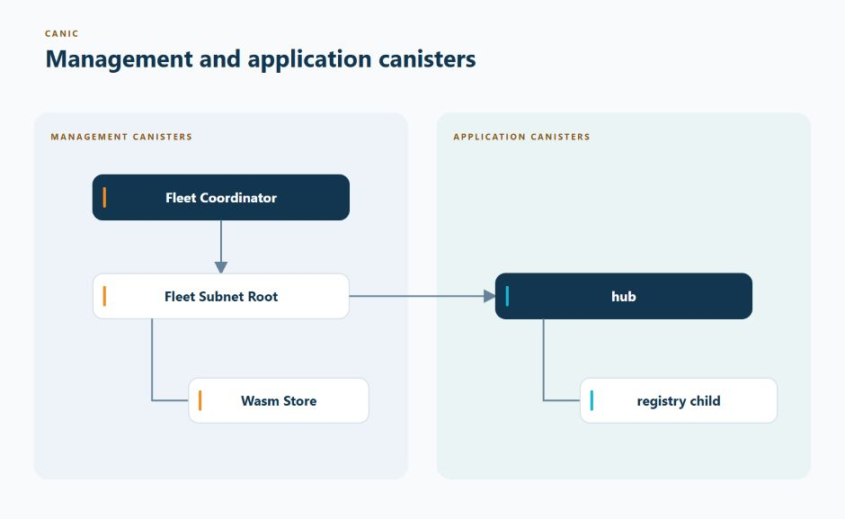

# Your First Managed Application

This guide shows a minimal managed application layout with two application roles:

- a `hub`, which is the main service; and
- a `registry`, which the hub is permitted to request as its child.

A **canister** is a program running on the Internet Computer. A **Fleet** is one
deployed copy of the complete application. A **Component** is one deployed
application canister together with its Canic identity and limits.

Canic also generates three management canisters: a Coordinator for the whole
Fleet, a Root that performs approved actions on one IC Subnet, and a Wasm Store
that holds the code Root may install. You do not write those management
packages. The source layout below contains only the `hub` and `registry`
application packages.

Before continuing, [install Canic](../../INSTALLING.md) and make sure the
`canic` command works. Keep the installed command-line tool and every `canic`
Rust dependency on the same version.

The initial Group deployment selects the hub. Declaring the registry role and
spawn grant permits later child creation; it does not create a registry at
startup. The handlers below demonstrate caller identity only. Add an application
workflow that requests the child when needed; the maintained
[index hub fixture](../../apps/test/index_hub/src/lib.rs) demonstrates runtime
creation for a separately configured keyed instance pool. Use this layout as a
reference before adapting it to a real product.

Root creates, installs, funds, and manages admitted canisters; it does not
forward normal application requests. Application canisters call one another
directly. A parent may ask Root to create an allowed child, and that child may
later do the same within the limits declared in configuration.

The walkthrough keeps product code deliberately small so the relationship
between App configuration, generated management canisters, and deployed
Components stays visible.

## What You Will Build

<p align="center">
  <a href="../../assets/management-and-application-canisters.jpg">
    
  </a>
</p>

The Coordinator owns the Fleet-wide view. Root performs approved lifecycle and
funding work on its Subnet. The `hub` and `registry` contain the application's
own behavior and call each other directly.

## Journey At A Glance

| Milestone | What you add |
| --- | --- |
| 1. Source layout | One App configuration and two Rust canister packages |
| 2. Local IC configuration | Build entries for Root, `hub`, and `registry` |
| 3. App configuration | Roles, one Component Spec, one Group, and one deployment |
| 4. Build integration | A small `build.rs` and Canic lifecycle macros |
| 5. Fleet convergence | A reviewed desired Fleet plan and its exact apply digest |

## Layout

```text
apps/example/
├── canic.toml
├── hub/
│   ├── Cargo.toml
│   ├── build.rs
│   └── src/lib.rs
└── registry/
    ├── Cargo.toml
    ├── build.rs
    └── src/lib.rs
```

Every canister package must declare the Canic role it implements. The role must
resolve to a declared role in `canic.toml`:

```toml
[package.metadata.canic]
app = "example"
role = "hub"
```

Because standalone `canic build` defaults to `fast`, define that Cargo profile
in the workspace root:

```toml
[profile.release]
opt-level = "z"
lto = true
codegen-units = 1
strip = "symbols"
debug = false
panic = "abort"
overflow-checks = false
incremental = false

[profile.fast]
inherits = "release"
lto = "thin"
codegen-units = 8
incremental = false
```

`fast` uses ThinLTO to reduce Wasm size while retaining more build parallelism
than `release`. Canic generates this profile for infrastructure packages.
Existing application workspaces should update their own `[profile.fast]` block;
Cargo does not inherit profiles from a dependency.

## Local IC Config (`icp.yaml`)

The `icp` command-line tool uses `icp.yaml` to run the application on a local IC
network. Its generated local state lives under `.icp/`. A new Canic App does
not need old `dfx.json` or `canister_ids.json` files.

Add matching canister and environment entries for the fleet roles:

```yaml
canisters:
  - name: root
    build:
      steps:
        - type: script
          commands:
            - canic build example root --profile fast
  - name: hub
    build:
      steps:
        - type: script
          commands:
            - canic build example hub --profile fast
  - name: registry
    build:
      steps:
        - type: script
          commands:
            - canic build example registry --profile fast

environments:
  - name: example
    network: local
    canisters: [root, hub, registry]
```

## App Config (`canic.toml`)

The App configuration declares the canister roles, a Component blueprint, the
child it may create, and one deployment of that blueprint. It describes what is
allowed, not the concrete canister IDs or physical IC Subnet used later.

```toml
[app]
name = "example"

[roles.root]
kind = "root"

[roles.hub]
kind = "canister"
package = "hub"

[roles.registry]
kind = "canister"
package = "registry"

[component_specs.main]
component_role = "hub"
maximum_instances = 1
topup = {}

[component_specs.main.children.registry]
kind = "singleton"
topup = {}

[component_specs.main.spawn_grants.hub.registry]
maximum_instances_per_parent = 1

[component_groups.main.components.hub]
component_spec = "main"

[component_group_deployments.main]
component_group = "main"
initial_placements = 1
maximum_placements = 1
placement.maximum_per_root = 1
placement.minimum_distinct_roots = 1
```

The Spec defines what one Component may contain. The Group selects that Spec,
and the Group deployment asks for exactly one running copy. None of these source
declarations chooses a physical Subnet or grants permission to change a live
network; the separately reviewed desired Fleet does that.

## Build Scripts

Each canister crate needs the same small `build.rs`. The path is relative to
the canister crate directory, so adjust it if your layout differs.

```rust
fn main() {
    canic::build!("../canic.toml");
}
```

If your canisters are nested more deeply, pass the real relative path, for
example `../../canic.toml`.

## Fleet Subnet Root

Declare `[roles.root]` with `kind = "root"` and omit `package`. The host generates
Root from the selected App configuration and its required
capabilities. There is no application Root crate, lifecycle hook or custom
endpoint surface. Coordinator and Store also use host-generated
entrypoint packages against the exact Canic dependency.

Build the configured Root with `canic build example root`. Its artifact binds
the exact configuration, capabilities and release identity. Fleet Ensure owns
initialization and readiness; application initialization belongs in the child
canisters. Pre-1.0 release transitions use explicit reviewed reinstall.

## Application Canisters

Both the hub Component and its potential registry child declare their role in
Cargo metadata and use Canic endpoint macros for application methods. Each
canister package must produce a `cdylib` Wasm artifact:

```toml
[lib]
crate-type = ["cdylib"]

[package.metadata.canic]
app = "example"
role = "hub"

[dependencies]
candid = "<version>"
canic = "<same-version-as-canic-cli>"
ic-cdk = "0.20"

[build-dependencies]
canic = "<same-version-as-canic-cli>"
```

```rust
#![expect(clippy::unused_async)]

use candid::Principal;
use canic::{Error, prelude::*};
use ic_cdk::api::msg_caller;

canic::start!();

async fn canic_setup() {}
async fn canic_install(_: Option<Vec<u8>>) {}
async fn canic_upgrade() {}

#[canic_query(public)]
fn whoami_query() -> Result<Principal, Error> {
    Ok(msg_caller())
}

#[canic_update(public)]
fn whoami_update() -> Result<Principal, Error> {
    Ok(msg_caller())
}

canic::finish!();
```

Use the same `lib.rs` shape for `registry`; set its role in that crate's
`Cargo.toml` instead:

```toml
[package.metadata.canic]
app = "example"
role = "registry"
```

## Ensure The Fleet

Create a desired Fleet document using the exact local Subnet, controllers,
artifacts and cycle bounds. The complete contract is in
[Fleet ensure](../features/operations/fleet-ensure.md).

Then exercise the current reviewed convergence boundary:

```bash
canic replica start --background
canic fleet ensure example-local --desired fleets/example-local.toml
canic fleet ensure example-local --desired fleets/example-local.toml --apply <plan_sha256>
```

On success, the reviewed operation has created or reused every canister selected
by that desired Fleet, reconciled its funding/controllers/Wasm/runtime state,
and recorded terminal cycle conservation. An immediate second run has zero
mutation actions.

Build one role without installing:

```bash
canic build example hub
```

If you pass `--workspace`, `--icp-root`, or `--config` explicitly, use absolute
paths for the explicit roots and config file.

## Testing Shape

A managed-Fleet PocketIC test should start from a deliberately inconsistent
estate, compile the same current desired plan, interrupt after each mutation
class, reconcile exact live results, reach terminal cycle conservation, and
prove an immediate second plan/apply performs zero mutation actions. Separate
runtime tests may then exercise application-specific parent/child behavior.

## Candid Surface

Canic-managed canisters expose application methods plus Canic runtime,
metadata, readiness, and management methods. When comparing an old non-Canic
canister to a Canic-managed rewrite, compare the application surface separately
from Canic-owned methods.

Canic uses a dedicated declaration build to extract each `.did`, then omits the
debug-only `get_candid_pointer` export from the final artifact. Local final
managed artifacts embed public `candid:service` metadata for introspection;
production `ICP_ENVIRONMENT=ic` artifacts skip that metadata. A focused
`canic build <app> <role> --standalone-local --features <features>` build keeps
Candid only in the adjacent `.did`, proves the runtime method exports match it,
and omits both the pointer export and embedded metadata from the deployable
Wasm.

## Continue From Here

- [Configure an App](../../CONFIG.md)
- [See how Canic works](how-canic-works.md)
- [Choose the Canic features you need](../features/README.md)
- [Plan and operate a Fleet](../operations/README.md)
- [Browse all documentation](../README.md)
